text/String
Sorting
Crypto
Graph Algorithms
Scheduling/Load Balancing

| 计算问题 (Computational Problem) | 所属领域 (Area) | 备注/答案 |
| :--- | :--- | :--- |
| How often does “Juliet” appear in Shakespeare’s “Romeo And Juliet”? | **text/strings** | 181 times |
| Sort an array of $n$ numbers | **all areas** | - |
| How do we factorize a large number? | **crypto** | - |
| Shortest way to travel from Bristol to Glasgow? | **graph algorithms** | - |
| How to execute a database query? | **databases** | - |
| Is it possible to partition the set $\{17, 8, 4, 22, 9, 28, 2\}$ into two sets s.t. their sums are equal? | **scheduling, load balancing** | $\{8, 9, 28\}, \{2, 4, 17, 22\}$ |

initial step 
array A (长度n = 16): 3, 7, 22, 47, 36, 33, 31, 30, 25, 21, 20, 15, 7, 4, 10, 22
下标范围: $0$ 到 $15$

First Call
计算 $mid = \lfloor 16/2 \rfloor = 8$。检查 $A[8]$ 是否为峰值 
对比: $A[8] = 25$。查看其邻居 $A[7] = 30$ 。
决策: 因为 $A[7] \ge A[8]$ (即 $30 \ge 25$)，算法向左半部分跳转 。
新范围: 递归查找子数组 $A[0 \dots 7]$，此时子数组长度变为 $8$ 

递归轮次,    检查下标 (mid),     对应数值,         比较结果
Round 1,       8,                 25,            A[7](30)>A[8](25)
Round 2,       4,                 36,            A[3](47)>A[4](36)
Round 3,       2,                 22,            A[1](7)<A[2](22)
Final,         3,                 47,              满足峰值条件

# runtime
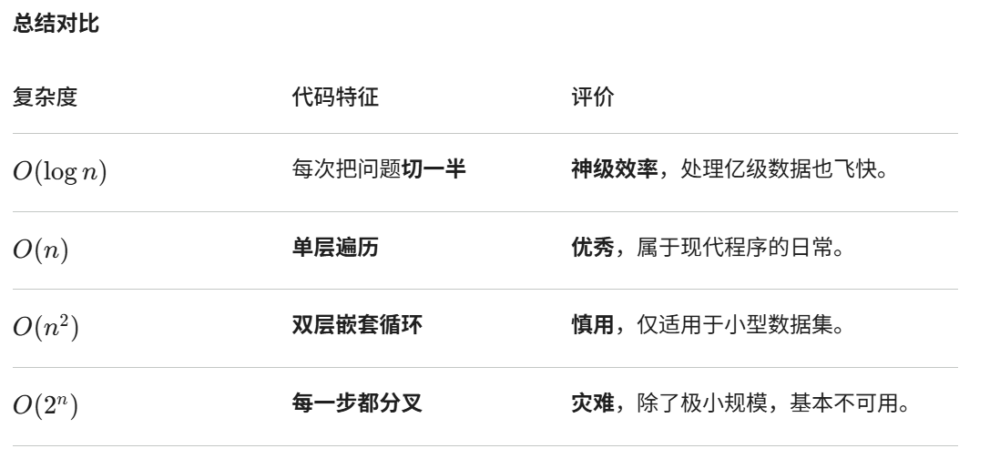

# Asymptotic Complexity 渐进复杂度
$当我们处理“足够大”的数据时，算法的“增长趋势”比它起步时的快慢要重要得多$
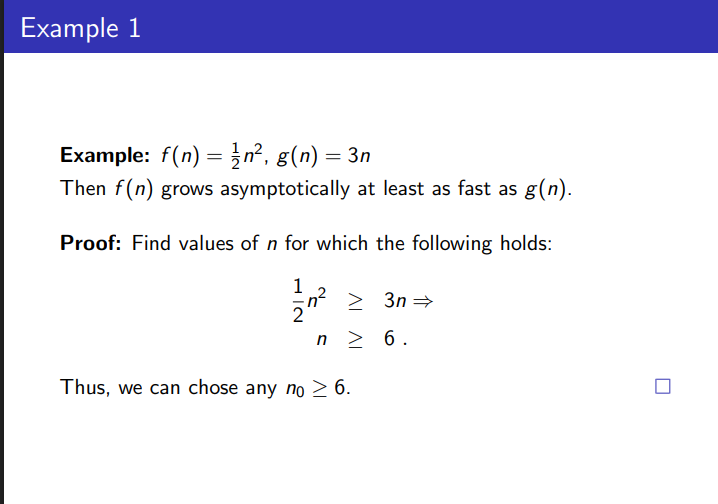
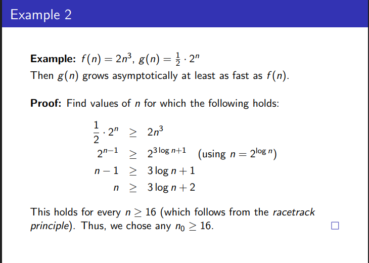

## big-O
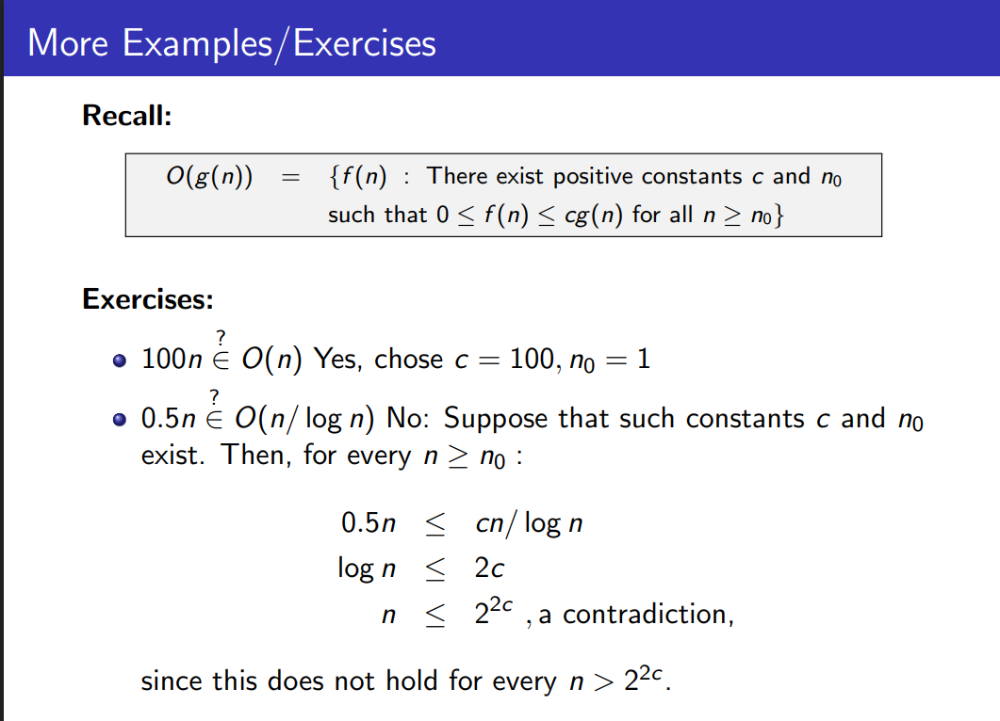 $n$ 必须小于一个固定值 $2^{2c}$ 结论：$n$ 的增长速度比 $n / \log n$ 快，所以 $n$ 不属于 $O(n / \log n)$
$100n$ 是 $O(n)$：因为增长阶数相同。$0.5n$ 不是 $O(n/\log n)$：因为左边增长得比右边快。

# Sum Rule
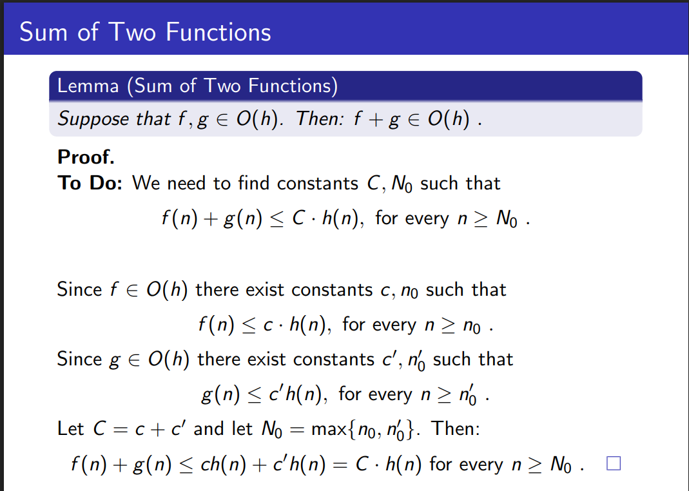
1. 正确的准则：多项式只看最高项 比如 $5n^3 + 2n^2 + 100$ 
复杂度直接等于它的最高阶项：$O(n^k)$。
2. 忽略低阶项：$n^2 + n \to n^2$。
   忽略常数项：$100n \to n$。
   找最紧上限：虽然 $n$ 是 $O(n^2)$，但我们更倾向于说它是 $O(n)$。
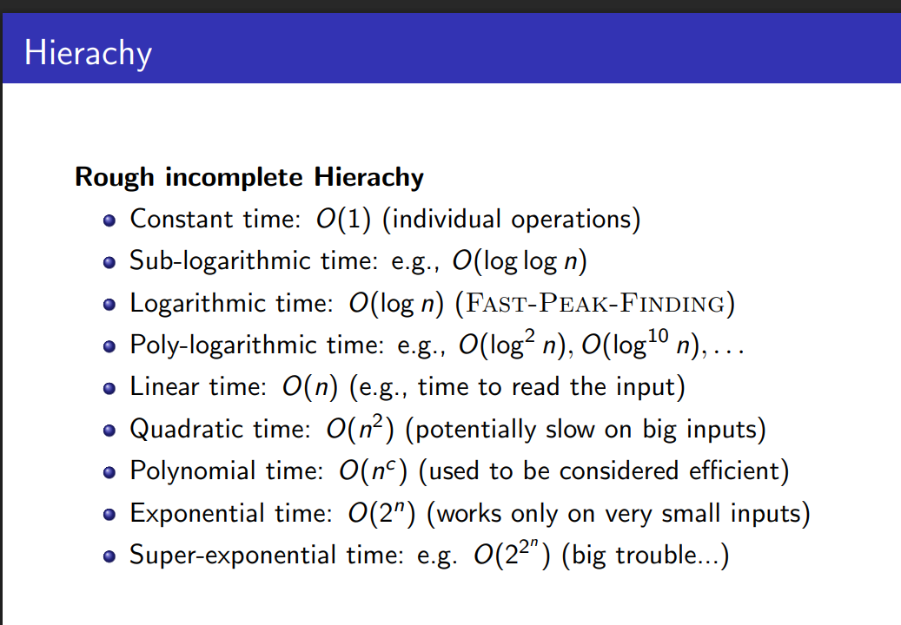

### Exercise Sheet 1

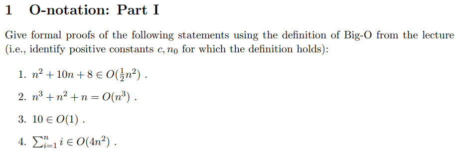

# 1. **证明** $n^2 + 10n + 8 \in O(\frac{1}{2}n^2)$
我们要找到 $c$ 和 $n_0$ 使得 $n^2 + 10n + 8 \le c \cdot (\frac{1}{2}n^2)$。

* **策略：** 当 $n \ge 1$ 时，我们可以通过放大各项来简化左式。
    * $n^2 = 1 \cdot n^2$
    * $10n \le 10n^2$ (当 $n \ge 1$)
    * $8 \le 8n^2$ (当 $n \ge 1$)
* **合并：** $n^2 + 10n + 8 \le 1n^2 + 10n^2 + 8n^2 = 19n^2$。
* **求解 $c$：** 我们需要 $19n^2 \le c \cdot \frac{1}{2}n^2$，即 $19 \le \frac{1}{2}c$，解得 $c = 38$。
* **结论：** 选择 $c = 38, n_0 = 1$。对于所有 $n \ge 1$，$n^2 + 10n + 8 \le 38(\frac{1}{2}n^2)$ 成立。

# 2. **证明** $n^3 + n^2 + n = O(n^3)$
我们要找到 $c$ 和 $n_0$ 使得 $n^3 + n^2 + n \le c \cdot n^3$。
* **策略：** 当 $n \ge 1$ 时：
    * $n^3 = 1 \cdot n^3$
    * $n^2 \le n^3$
    * $n \le n^3$
* **合并：** $n^3 + n^2 + n \le 1n^3 + 1n^3 + 1n^3 = 3n^3$。
* **结论：** 选择 $c = 3, n_0 = 1$。对于所有 $n \ge 1$，$n^3 + n^2 + n \le 3n^3$ 成立。

# 3. **证明** $10 \in O(1)$
我们要找到 $c$ 和 $n_0$ 使得 $10 \le c \cdot 1$。
* **策略：** 这非常直接，因为左边是一个常数。
* **结论：** 选择 $c = 10, n_0 = 1$。对于所有 $n \ge 1$，$10 \le 10$ 显然成立。

# 4. **证明** $\sum_{i=1}^{n} i \in O(4n^2)$
我们要找到 $c$ 和 $n_0$ 使得 $\sum_{i=1}^{n} i \le c \cdot 4n^2$。

* **第一步：使用等差数列求和公式**

$$\sum_{i=1}^{n} i = \frac{n(n+1)}{2} = \frac{1}{2}n^2 + \frac{1}{2}n$$

* **第二步：放大各项**
  当 $n \ge 1$ 时：
    * $\frac{1}{2}n^2 = \frac{1}{2}n^2$
    * $\frac{1}{2}n \le \frac{1}{2}n^2$
* **合并：** $\frac{1}{2}n^2 + \frac{1}{2}n \le 1n^2$。
* **求解 $c$：** 我们需要 $1n^2 \le c \cdot 4n^2$，即 $1 \le 4c$，解得 $c = 0.25$（或选更大的整数如 $c = 1$ 也可以）。
* **结论：** 选择 $c = 1, n_0 = 1$。对于所有 $n \ge 1$，$\sum_{i=1}^{n} i \le 1 \cdot 4n^2$ 成立。

## 2. Racetrack Principle
Use the racetrack principle to prove the following statement:
$$n \le e^n \text{ holds for every } n \ge 1 .$$

> **Solution.** First, we verify that $n \le e^n$ holds for $n = n_0 = 1$. This is true, since $1 \le e$ holds. 
> 
> Next, we verify that $(n)' \le (e^n)'$ holds for every $n \ge n_0$. We have $(n)' = 1$ and $(e^n)' = e^n$. We thus need to show that $1 \le e^n$ holds for every $n \ge 1$. 
> 
> Taking the natural logarithm on both sides, we obtain $0 \le n$, which is true for every $n \ge n_0 = 1$. Hence, $n \le e^n$ holds for every $n \ge 1$. $\checkmark$

## 3. O-notation: Part II
Give formal proofs of the following statements using the definition of Big-O from the lecture.

# 1. $f \in O(h_1), g \in O(h_2)$ then $f \cdot g \in O(h_1 \cdot h_2)$ .

**Solution.** Similar as in the previous exercise, we know that there are constants $c_1, c_2, n_1, n_2$ such that $f(n) \le c_1 \cdot h_1(n)$, for every $n \ge n_1$, and $g(n) \le c_2 \cdot h_2(n)$, for every $n \ge n_2$. Then:
$$f(n) \cdot g(n) \le c_1 \cdot h_1(n) \cdot c_2 \cdot h_2(n) = c_1 c_2 \cdot h_1(n)h_2(n)$$
for every $n \ge \max\{n_1, n_2\}$. We thus select $C = c_1 \cdot c_2$ and $N = \max\{n_1, n_2\}$ and obtain $f(n)g(n) \le C(h_1(n)h_2(n))$, for every $n \ge N$. $\checkmark$

---

# 2. $2^n \in O(n!)$ .

**Solution.** To prove this statement, we will show that $2^n \le C \cdot n!$ holds for $C = 2$ and every $n \ge 2$. To this end, observe that $2^n \le 2n!$ is equivalent to $2^{n-1} \le n!$. Observe that
$$2^{n-1} = \underbrace{2 \cdot 2 \cdot \dots \cdot 2}_{(n-1) \text{ times}},$$
and
$$n! = \underbrace{2 \cdot 3 \cdot \dots \cdot n}_{(n-1) \text{ factors, each larger equal to 2}}.$$
Trading off the factors of the two expressions, we see that $2^{n-1} \le n!$, which proves the result. $\checkmark$

---

# 3. $2^{\sqrt{\log n}} \in O(n)$ .

**Solution.** We need to show that there are constants $c, n_0$ such that $2^{\sqrt{\log n}} \le c \cdot n$ holds for every $n \ge n_0$. Observe that the previous inequality is equivalent to $2^{\sqrt{\log n}} \le 2^{\log(n) + \log(c)}$, which holds if $\sqrt{\log n} \le \log(n) + \log(c)$. Observe that $\sqrt{x} \le x$ for every $x \ge 1$. Hence, $\sqrt{\log n} \le \log(n)$ holds for every $\log(n) \ge 1$, or every $n \ge 2$. We can thus pick $n_0 = 2$ and $c = 1$ (observe that $\log(x) < 0$ for $x < 1$, we therefore couldn't choose $c < 1$). $\checkmark$

## Theta and Omega

# 算法复杂度符号指南 (Big O Notation)

| 符号 | 名称 | 含义 | 直观理解 |
| :--- | :--- | :--- | :--- |
| $\Theta(n)$ | **Theta** (西塔) | **确界** (Tight Bound) | **刚刚好**：增长率被精确确定（既是上界也是下界）。 |
| $\Omega(n)$ | **Omega** (欧米茄) | **下界** (Lower Bound) | **至少**：算法最快也就这样了，不会比这更省时。 |
| $O(n)$      | **Big O** (大 O) | **上界** (Upper Bound) | **至多**：算法最坏的情况，保证不会超过这个界限。 |

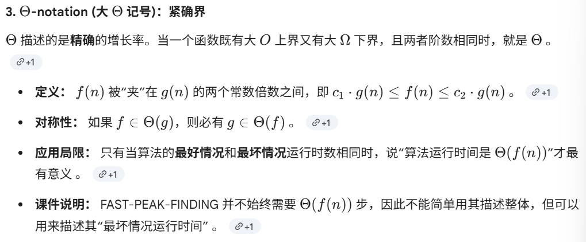
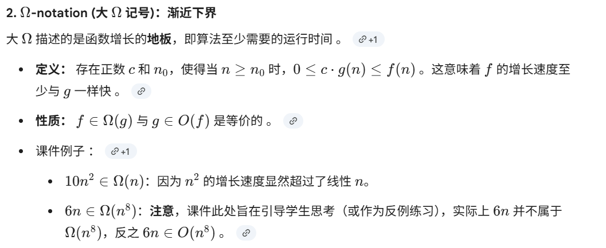
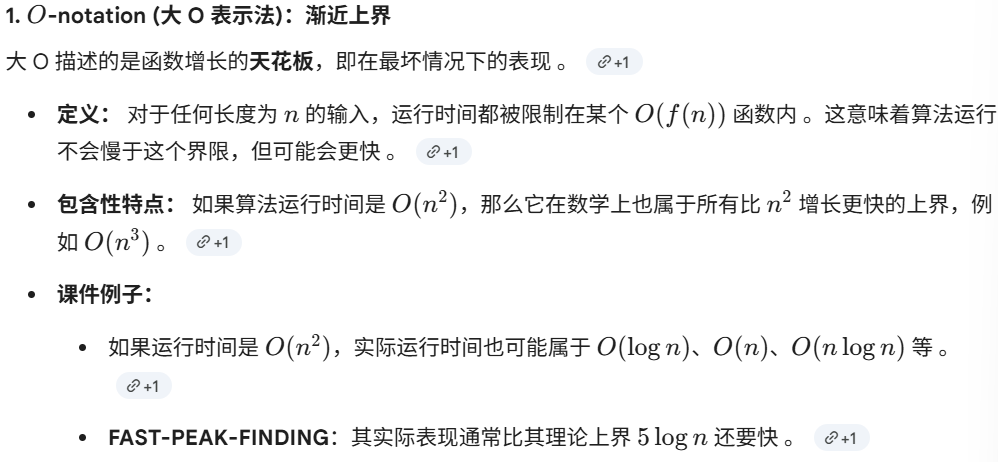
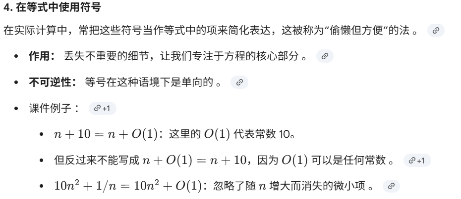

### Exercise Sheet 2
 
# 111
A
s = 0                  # 1次操作
for i = 0 to n-1:      # 循环 n 次
    s = s + A[i]       # 每次循环内 1次操作 (RAM模型下代价为1)
return s               # 1次操作

计算：$1 + n \times 1 + 1 = n + 2$。结论：在渐近意义下，其复杂度为 $O(n)$。

B
s = 0
for i = 0 to n-1:      # 外层执行 n 次
    for j = i to 2*i:  # 内层执行 i+1 次
        s = s + A[i]
return s

数学推导：$\sum_{i=0}^{n-1} (i+1) = \frac{n(n+1)}{2} = \frac{1}{2}n^2 + \frac{1}{2}n$。结论：忽略常数和低阶项，复杂度为 $O(n^2)$。

## 1 Θ and Ω

# （1）**命题：** $f(n) = \Theta(g(n))$ 当且仅当 $f(n) = O(g(n))$ 且 $g(n) = O(f(n))$。

---
**命题：** $f(n) = \Theta(g(n))$ 当且仅当 $f(n) = O(g(n))$ 且 $g(n) = O(f(n))$。

---

 1. 必要性证明：$f \in \Theta(g) \implies f \in O(g)$ 且 $g \in O(f)$

**前提：**
根据 $\Theta$ 的定义，存在正系数 $c_1, c_2$ 和自然数 $n_0$，使得对于所有 $n \ge n_0$，都有：
$$c_1 g(n) \le f(n) \le c_2 g(n)$$

**推导过程：**
1. **证明 $f \in O(g)$**：
   直接取不等式的右半部分：$f(n) \le c_2 g(n)$。
   根据 $O$ 的定义，这说明 $f$ 的增长率不高于 $g$，即 $f \in O(g)$。
   
2. **证明 $g \in O(f)$**：
   取不等式的左半部分：$c_1 g(n) \le f(n)$。
   将其变形得：$g(n) \le \frac{1}{c_1} f(n)$。
   令新的常数 $C = 1/c_1$，则符合 $O(f)$ 的定义，即 $g \in O(f)$。

---

#  充分性证明：$f \in O(g)$ 且 $g \in O(f) \implies f \in \Theta(g)$

**前提：**
* 由 $f \in O(g)$ 可知：存在 $c_1, n_1$，使得 $f(n) \le c_1 g(n)$ 对于 $n \ge n_1$ 成立。
* 由 $g \in O(f)$ 可知：存在 $c_2, n_2$，使得 $g(n) \le c_2 f(n)$ 对于 $n \ge n_2$ 成立。

**推导过程：**
1. **不等式变形**：
   将第二个前提变形得：$f(n) \ge \frac{1}{c_2} g(n)$。
   
2. **合成不等式链**：
   为了使两个不等式同时成立，我们取 $n_0 = \max(n_1, n_2)$。对于所有 $n \ge n_0$：
   $$\frac{1}{c_2} g(n) \le f(n) \le c_1 g(n)$$

**结论：**
设定新的常数 $d_1 = \frac{1}{c_2}$ 和 $d_2 = c_1$，上式完全符合 $\Theta$ 的定义：
$$d_1 g(n) \le f(n) \le d_2 g(n)$$
因此，$f \in \Theta(g)$ 证毕。

---

## （2）命题证明：$\Omega$ 与 $O$ 的对称性

**命题：** 以下两个陈述是等价的（Equivalent）：
1. $f(n) = \Omega(g(n))$
2. $g(n) = O(f(n))$

---

### 证明过程

#### 1. 必要性证明：$f \in \Omega(g) \implies g \in O(f)$

**前提：**
根据 $\Omega$ 的定义，存在正系数 $c_1$ 和自然数 $n_1$，使得对于所有 $n \ge n_1$，都有：
$$c_1 g(n) \le f(n)$$

**推导：**
1. 我们需要找到常数 $c_2, n_2$，使得 $g(n) \le c_2 f(n)$。
2. 将前提中的不等式两边同时除以 $c_1$（由于 $c_1 > 0$，不等号方向不变）：
   $$g(n) \le \frac{1}{c_1} f(n)$$
3. 此时，我们只需取 **$c_2 = \frac{1}{c_1}$** 且 **$n_2 = n_1$**。
4. 这完全符合 $O(f)$ 的定义，故 $g \in O(f)$。

---

#### 2. 充分性证明：$g \in O(f) \implies f \in \Omega(g)$

**前提：**
根据 $O$ 的定义，存在正系数 $c_2$ 和自然数 $n_2$，使得对于所有 $n \ge n_2$，都有：
$$g(n) \le c_2 f(n)$$

**推导：**
1. 我们需要找到常数 $c_1, n_1$，使得 $f(n) \ge c_1 g(n)$。
2. 将前提中的不等式两边同时除以 $c_2$：
   $$\frac{1}{c_2} g(n) \le f(n) \quad \Rightarrow \quad f(n) \ge \frac{1}{c_2} g(n)$$
3. 此时，我们只需取 **$c_1 = \frac{1}{c_2}$** 且 **$n_1 = n_2$**。
4. 这完全符合 $\Omega(g)$ 的定义，故 $f \in \Omega(g)$。

---

## （3） (a) 证明：$\log_c n \in \Theta(\log n)$ （其中 $c > 1$ 为常数）

**核心逻辑**：对数的底数变换只会引入一个常数系数。

**证明过程：**
1. **回顾定义**：我们需要找到常数 $c_1, c_2, n_0$，使得对于所有 $n \ge n_0$：
   $$c_1 \log n \le \log_c n \le c_2 \log n$$
2. **公式变换**：根据对数换底公式：
   $$\log_c n = \frac{\log n}{\log c}$$
3. **选取参数**：
   * 令 $c_1 = c_2 = \frac{1}{\log c}$
   * 令 $n_0 = 1$
4. **验证**：
   由于 $c > 1$ 为常数，则 $\frac{1}{\log c}$ 也是一个确定的正数。
   此时，$c_1 \cdot \log n = \frac{\log n}{\log c} = \log_c n$ 恒成立。
   
**结论**：$\log_c n \in \Theta(\log n)$ 成立。这说明在 $O$ 记号中，对数的底数通常可以忽略不写。

---

### (b) 证明：$\log(n^c) \in \Theta(\log n)$ （其中 $c > 1$ 为常数）

**核心逻辑**：对数内部的常数指数可以提取出来作为系数。

**证明过程：**
1. **回顾定义**：我们需要找到常数 $c_1, c_2, n_0$，使得对于所有 $n \ge n_0$：
   $$c_1 \log n \le \log(n^c) \le c_2 \log n$$
2. **公式变换**：根据对数性质：
   $$\log(n^c) = c \cdot \log n$$
3. **选取参数**：
   * 令 $c_1 = c_2 = c$
   * 令 $n_0 = 1$
4. **验证**：
   代入得 $c \cdot \log n = c \cdot \log n$，不等式左右两端完全相等且符合 $\Theta$ 的界限。

**结论**：$\log(n^c) \in \Theta(\log n)$ 成立。

---

## （4）命题辨析：指数函数的底数对复杂度的影响

**命题：** 设 $c > 2$ 是一个常数。证明或反驳：$c^n \in \Theta(2^n)$。

---

# (使用反证法)

我们要证明 $c^n \notin \Theta(2^n)$。根据 $\Theta$ 的定义，如果 $f \in \Theta(g)$，则必然有 $f \in O(g)$。因此，我们只需要证明 **$c^n \notin O(2^n)$** 即可推翻原命题。

1. **假设命题成立**：
   假设 $c^n \in O(2^n)$。根据 $O$ 的定义，存在常数 $d > 0$ 和 $n_0$，使得对于所有 $n \ge n_1$：
   $$c^n \le d \cdot 2^n$$

2. **两边取对数**：
   对不等式两边同时取对数（以 $2$ 为底或自然对数均可）：
   $$\log(c^n) \le \log(d \cdot 2^n)$$
   利用对数性质展开：
   $$n \log c \le \log d + n \log 2$$
   由于 $\log 2 = 1$（假设以 2 为底），整理得：
   $$n \log c \le \log d + n$$

3. **移项并提取 $n$**：
   $$n (\log c - 1) \le \log d$$
   $$n \le \frac{\log d}{\log c - 1}$$

4. **导出矛盾**：
   * 因为前提条件是 **$c > 2$**，所以 $\log c > 1$，这意味着分母 $(\log c - 1)$ 是一个**正数**。
   * 右侧的 $\frac{\log d}{\log c - 1}$ 是一个**固定常数**。
   * 然而，左侧的 $n$ 是可以趋于无穷大的变量。
   * **矛盾点**：一个趋于无穷大的变量 $n$ 不可能永远小于等于一个固定常数。

**结论：**
当初的假设 $c^n \in O(2^n)$ 不成立，因此 $c^n \notin \Theta(2^n)$。

---

### 2 O-notation

## 函数增长阶数排序 (Asymptotic Order of Growth)

**题目：** 给定以下 6 个函数，按增长速度从小到大排序，使得 $f_i \in O(f_{i+1})$。

* $f_1 = 2^{\sqrt{n}}$
* $f_2 = \log^2(20n)$
* $f_3 = n!$
* $f_4 = \frac{1}{2}n^2 / \log n$
* $f_5 = 4 \log^2 n$
* $f_6 = 2^{\sqrt{\log n}}$

---

# 排序结果 (从小到大)

按照 $O$ 记号的包含关系，排序如下：

$$O(\log^2(20n)) \subseteq O(4 \log^2 n) \subseteq O(2^{\sqrt{\log n}}) \subseteq O(\frac{1}{2}n^2 / \log n) \subseteq O(2^{\sqrt{n}}) \subseteq O(n!)$$

---

# 1. 对数级别：$f_2$ vs $f_5$
* **$f_2 = \log^2(20n)$**：展开后为 $(\log 20 + \log n)^2 \approx \log^2 n + \text{常数} \cdot \log n$。
* **$f_5 = 4 \log^2 n$**：这是一个常数倍的 $\log^2 n$。
* **结论**：它们在渐近意义上是同阶的（$\Theta$ 关系），但在具体排序中，由于 $f_2$ 的主导项系数为 1，而 $f_5$ 为 4，故 $f_2 \in O(f_5)$。

# 2. 准对数/超对数级别：$f_6 = 2^{\sqrt{\log n}}$
这个函数最容易排错。我们对比它和对数函数 $f_5$ 的对数：
* $\log(f_6) = \sqrt{\log n} \cdot \log 2 = \Theta(\sqrt{\log n})$
* $\log(f_5) = \log(4 \log^2 n) = \log 4 + 2 \log(\log n) = \Theta(\log(\log n))$
* **比较**：由于 $\sqrt{x}$ 的增长速度远快于 $\log x$（这里 $x = \log n$），所以 **$f_6$ 增长更快**。

# 3. 多项式级别：$f_4 = \frac{1}{2} n^2 / \log n$
* 虽然分母有一个 $\log n$ 在减速，但分子是强力的 $n^2$。
* 在渐近分析中，多项式（Polynomial）的增长速度永远压倒对数（Logarithmic）及其任何次方。

# 4. 次指数级别：$f_1 = 2^{\sqrt{n}}$
我们将它与多项式 $f_4$ 进行对数比较：
* $\log(f_1) = \sqrt{n} \cdot \log 2 = \Theta(\sqrt{n})$
* $\log(f_4) \approx \log(n^2) = 2 \log n = \Theta(\log n)$
* **比较**：由于 $\sqrt{n}$ 远快于 $\log n$，所以 **$f_1$ 最终会远超多项式 $f_4$**。

# 5. 阶乘级别：$f_3 = n!$
* 根据 **斯特林公式 (Stirling's Approximation)**：$n! \approx \sqrt{2\pi n} (\frac{n}{e})^n$。
* 阶乘的增长速度是“王者级”的，它不仅超过了多项式，也超过了任何常数底数的指数函数（如 $2^n, 10^n$）。

# $$\text{常数} < \text{对数} < \text{多项式} < \text{指数} < \text{阶乘}$$
---

## （2） Problem
Give functions $f, g$ such that $f(n) \in O(g(n))$ and $2^{f(n)} \notin O(2^{g(n)})$.

---

# Solution
Consider for example:
$$f(n) = \log n \quad \text{and} \quad g(n) = \frac{1}{2} \log n$$

**1. Verification of $f(n) \in O(g(n))$:**
Since $f(n) = 2 \cdot g(n)$, it follows by definition that $f(n)$ is bounded by a constant multiple of $g(n)$. Thus, $f(n) = O(g(n))$.

**2. Verification of $2^{f(n)} \notin O(2^{g(n)})$:**
Let's evaluate the exponential terms (assuming base 2 for the logarithm):
* $2^{f(n)} = 2^{\log n} = n$
* $2^{g(n)} = 2^{\frac{1}{2} \log n} = (2^{\log n})^{1/2} = n^{1/2} = \sqrt{n}$

**Conclusion:**
Since $n$ grows strictly faster than $\sqrt{n}$, we have $n \notin O(\sqrt{n})$. 
Therefore, $2^{f(n)} \notin O(2^{g(n)})$.
 
---

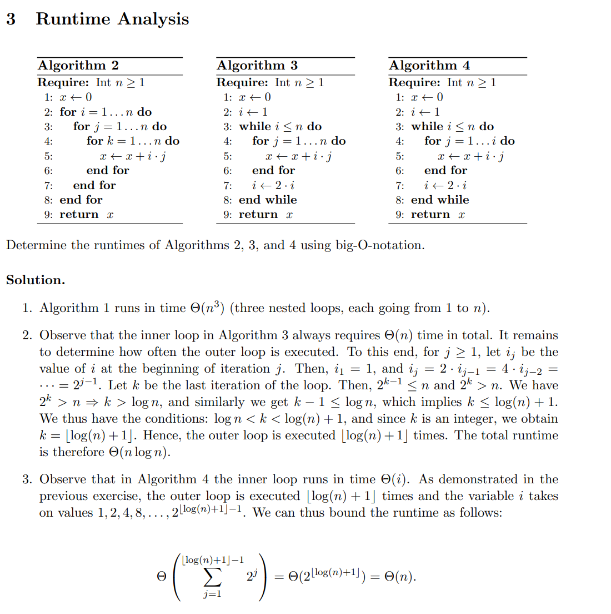

---

## Linear and Binary Search

# 1. 线性搜索：平均情况的计算例子

我们通过定义辅助函数 $LEFT(A, t)$（即目标 $t$ 第一次出现的索引）来计算算法的执行步数。

# 查找步数计算逻辑
* **成功与失败的步数：** 执行次数 = 索引位置 + 1。

* **例子 A（查找成功）：**
    在数组 `[2, 3, 1, 9, 2]` 中查找 `9`。
    * 数字 `9` 位于索引 `3`。
    * $LEFT(23192, 9) = 3$。
    * 循环从索引 `0` 运行到 `3`，总执行次数为 $3 + 1 = 4$ 次。

* **例子 B（查找失败）：**
    在数组 `[0, 0, 0, 0]` 中查找 `1`。
    * 数字 `1` 不存在。
    * 根据定义 $LEFT(0000, 1) = 4$（即数组长度 $n$）。
    * 总执行次数为 $4 + 1 = 5$ 次。

# 二进制特殊情况 ($k=2$) 的数学证明
**背景：** 假设数组只包含 $0$ 或 $1$，目标值 $t=1$。

1.  **概率模型：** 在第 $i$ 个位置找到 $1$ 的概率基于前 $i$ 个位置全是 $0$，且第 $i+1$ 个位置是 $1$。
2.  **级数推导：** 平均步数 $AVG$ 的求和公式为：
    $$AVG = \sum_{i=0}^{n-1} \frac{i+1}{2^{i+1}} + \frac{n+1}{2^n}$$
3.  **结论：** 利用错位相减法可证明 $\sum \frac{i}{2^i} \leq 2$。
    * 最终得出平均步数 $\leq 3$。
    * **平均复杂度：** $O(1)$。

---

# 2. 二分搜索：最坏情况的推导过程

二分搜索通过不断将搜索范围“减半”来缩减计算量。

# 递归过程
1.  **输入：** 已排序数组 $A$ 和目标 $t$。
2.  **比较：** 检查中间元素 $A[\lfloor n/2 \rfloor]$。
3.  **分支：**
    * 若中间元素 $> t$，递归进入左半部分 $A[0, \dots, \lfloor n/2 \rfloor - 1]$。
    * 若中间元素 $< t$，递归进入右半部分。

# 运行时间的数学推导
为了计算最坏情况，我们假设经过 $r$ 次递归后，数组规模变为 $n/2^r$。

* **终止条件：** 当数组规模缩小到 $\leq 2$ 时停止。
* **计算方程：** $$\frac{n}{2^r} \leq 2$$
* **解方程步骤：**
    1.  $n \leq 2 \cdot 2^r \Rightarrow n \leq 2^{r+1}$
    2.  两边取对数：$\log_2 n \leq r + 1$
    3.  得出：$r \approx \log_2 n$

> **结论：** 二分搜索在最坏情况下的运行时间为 **$O(\log n)$**。

---

# 总结

| 算法 | 核心逻辑 | 复杂度表现 |
| :--- | :--- | :--- |
| **线性搜索** | 将“索引位置”转化为“循环步数” | 展示了步数如何随位置线性增长 |
| **二分搜索** | 通过“指数级规模缩减”进行搜索 | 将线性增长的时间压制为对数增长 |

---

## Proofs by Induction

# 数学证明：数学归纳法 (Mathematical Induction)

本篇文档展示了数学归纳法的基本结构，并通过**等比级数求和**的具体例子来演示其应用。

---

## 1. 数学归纳法的结构 (Structure of a Proof)

要证明一个关于自然数 $n$ 的命题 $P(n)$ 对所有 $n \in \mathbb{N}$ 都成立，通常需要遵循以下三个标准步骤：

1.  **基准情况 (Base Case)：** 证明 $P(0)$（或定义的最小自然数 $n$）成立。
2.  **归纳假设 (Induction Hypothesis)：** 假设 $P(n)$ 对于某个特定的 $n$ 是成立的。
3.  **归纳步骤 (Induction Step)：** 利用归纳假设，证明 $P(n+1)$ 也成立。

---

## 2. 具体实例：等比级数求和 (Geometric Series)

我们将利用数学归纳法来证明等比级数求和公式。

### 待证命题 $P(n)$
当 $x \neq 1$ 时：
$$\sum_{i=0}^{n} x^i = \frac{x^{n+1} - 1}{x - 1}$$

---

### 证明过程

#### 第一步：基准情况 ($n=0$)
* **左边 (LHS)：** $\sum_{i=0}^{0} x^i = x^0 = 1$
* **右边 (RHS)：** $\frac{x^{0+1} - 1}{x - 1} = \frac{x-1}{x-1} = 1$
> **结论：** 左右相等，基准情况成立。

#### 第二步：归纳假设
假设对于任意 $n$，公式成立，即：
$$\sum_{i=0}^{n} x^i = \frac{x^{n+1} - 1}{x - 1}$$

#### 第三步：归纳步骤 ($n \to n+1$)
我们需要证明当 $n$ 增加到 $n+1$ 时，命题依然成立。

1.  **展开求和项：**
    $$\sum_{i=0}^{n+1} x^i = x^{n+1} + \sum_{i=0}^{n} x^i$$

2.  **代入归纳假设：**
    将假设中的公式代入上式：
    $$= x^{n+1} + \frac{x^{n+1} - 1}{x - 1}$$

3.  **通分并化简：**
    $$= \frac{x^{n+1}(x - 1) + x^{n+1} - 1}{x - 1}$$
    $$= \frac{x^{n+2} - x^{n+1} + x^{n+1} - 1}{x - 1}$$
    $$= \frac{x^{n+2} - 1}{x - 1}$$

---

## sheet 3
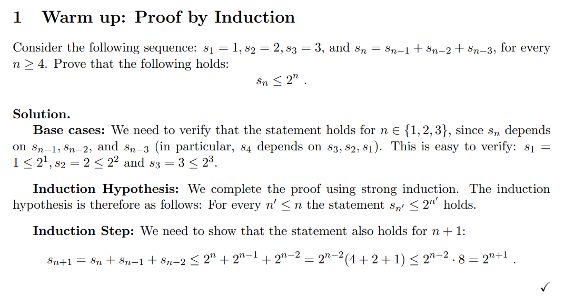
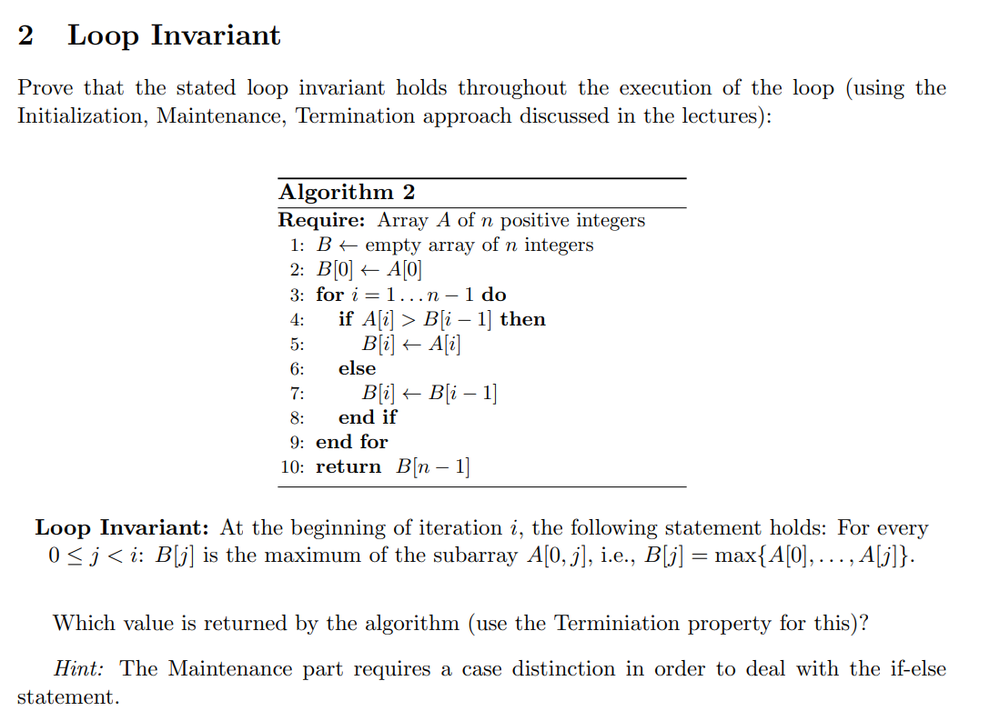

Markdown
# 算法正确性证明：循环不变式 (Loop Invariant)

本解析通过“循环不变式”方法，证明了一个寻找数组最大值算法的正确性。

---

## 核心目标
证明算法在循环过程中，变量 $B[i]$ 始终能正确存储子数组 $A[0 \dots i]$ 的最大值。

## 证明过程详解

# 1. 初始化 (Initialization)
> **目的：** 证明在循环开始前（$i=1$）结论成立。

* 当 $i=1$ 时，不变式要求 $B[0]$ 是 $A[0 \dots 0]$ 的最大值。
* **算法逻辑：** 根据算法实现，执行 $B[0] \leftarrow A[0]$。
* **结论：** 只有一个元素的集合，其最大值显然就是它本身。因此，**初始化成立**。

---
# 2. 保持 (Maintenance)
> **目的：** 证明如果第 $i$ 次迭代开始时成立，那么第 $i+1$ 次开始时也成立。

这是证明最核心的部分。我们基于**归纳假设**进行分类讨论：
* **假设：** 在进入第 $i$ 次循环时，$B[i-1]$ 已经是前缀数组 $A[0 \dots i-1]$ 的最大值。

# 情况 A：$A[i] > B[i-1]$
* 如果当前元素 $A[i]$ 大于之前的最大值，那么全集 $A[0 \dots i]$ 的新最大值必然是 $A[i]$。
* **代码动作：** 执行 $B[i] \leftarrow A[i]$。
* **结果：** 符合逻辑。

# 情况 B：$A[i] \leq B[i-1]$
* 如果当前元素不大于之前的最大值，那么全集 $A[0 \dots i]$ 的最大值依然是旧的最大值 $B[i-1]$。
* **代码动作：** 执行 $B[i] \leftarrow B[i-1]$。
* **结果：** 符合逻辑。

> **保持性结论：** 无论哪种情况，执行完循环体后，$B[i]$ 都正确存储了 $A[0 \dots i]$ 的最大值。因此，**保持性成立**。

---

# 3. 终止 (Termination)
> **目的：** 证明循环结束时，算法得到了预期的最终结果。

* **终止条件：** 循环在索引 $i$ 达到 $n$ 时终止。
* **状态检查：** 根据不变式的保持性，此时 $B[n-1]$ 存储的是 $A[0 \dots n-1]$ 的最大值（即整个数组的最大值）。
* **算法输出：** 算法最后返回 $B[n-1]$。

**最终结论：** 该算法成功返回了数组 $A$ 的最大值，算法正确性得证。

---

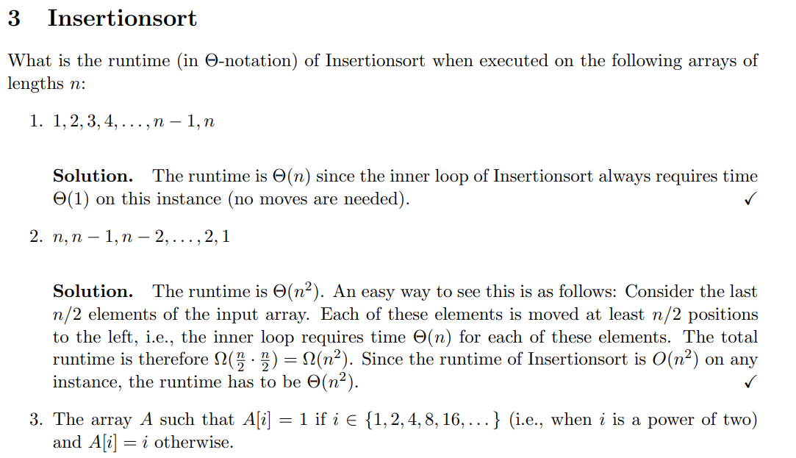
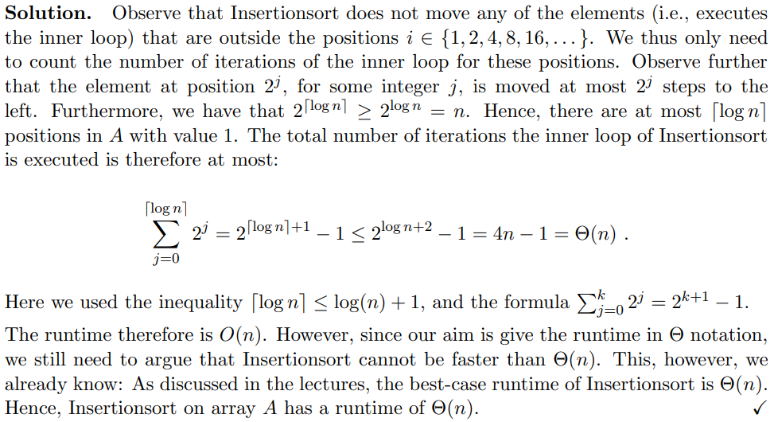
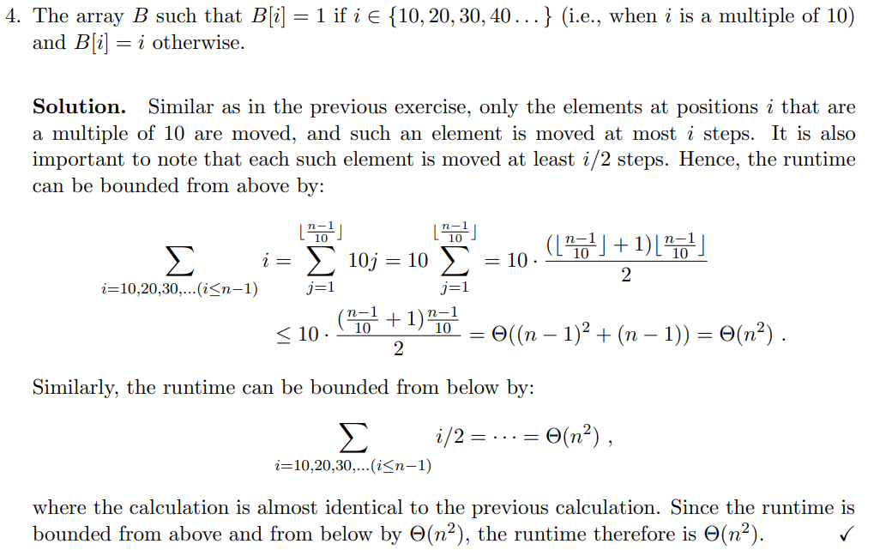
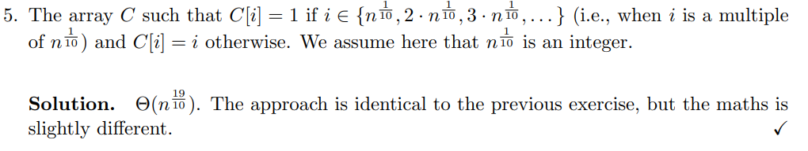
---

## 🚀 模型一：线性模型 (Linear Model)
**适用场景：** 数组几乎有序，或“乱序”元素极度稀疏（如按 $2^n$ 指数级增长）。

* **特征：** 内层循环的总步数之和与 $n$ 成正比。
* **案例分析：**
    * **完全有序：** 交换步数为 $0$。总复杂度：$\Theta(n)$。
    * **2 的幂位置偏移：** * 公式：$\sum 2^j$ （等比级数）。
        * 结论：尽管某些元素移动距离长，但乱序元素极少，总步数 $\approx 2n$。
        * **结果：** $\Theta(n)$。

---

## ⚖️ 模型二：平方模型 (Quadratic Model)
**适用场景：** 最坏情况。乱序元素按“等差数列”出现，或数据完全逆序。

* **特征：** 乱序元素的数量占数组长度 $n$ 的固定比例。
* **案例分析：**
    * **完全逆序：** * 公式：$1 + 2 + 3 + \dots + n = \frac{n(n+1)}{2}$
        * **结果：** $\Theta(n^2)$。
    * **固定间隔分布（如每 10 个有一个乱序）：**
        * 公式：$\sum 10j = 10 \cdot \frac{k(k+1)}{2}$ （其中 $k = n/10$）。
        * 结论：只要符合等差数列求和，其最高次项必为 $n^2$。
        * **结果：** $\Theta(n^2)$。

---

## 📉 模型三：分数幂模型 (Fractional Power Model)
**适用场景：** 乱序元素的出现频率随 $n$ 的增长而动态变化。

### 🏗️ 万能计算公式
$$\text{总复杂度} \approx (\text{乱序元素的个数}) \times (\text{每个元素平均移动的距离})$$

#### 第 5 题深度拆解：
* **乱序个数：** $\frac{n}{n^{1/10}} = n^{9/10}$
* **移动距离：** 平均移动距离与 $n$ 同阶，即 $O(n)$。
* **总计算：** $n^{9/10} \times n^1 = n^{19/10}$
* **结果：** $\Theta(n^{1.9})$

---
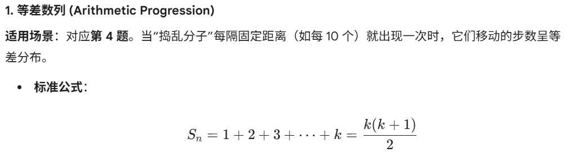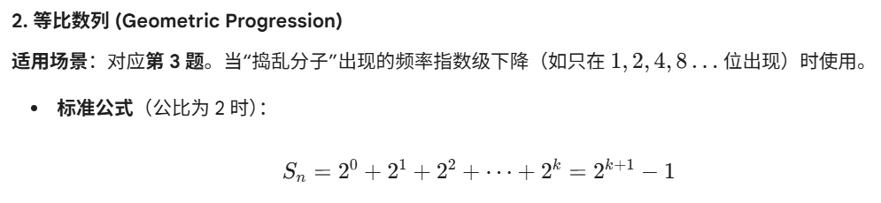

### run time analysis

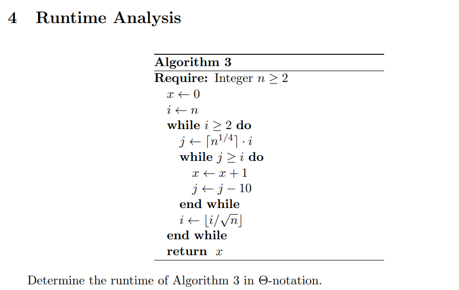
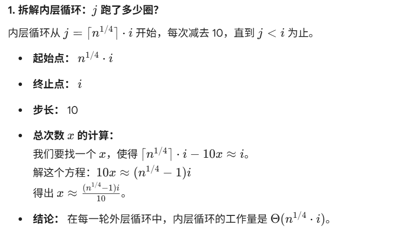
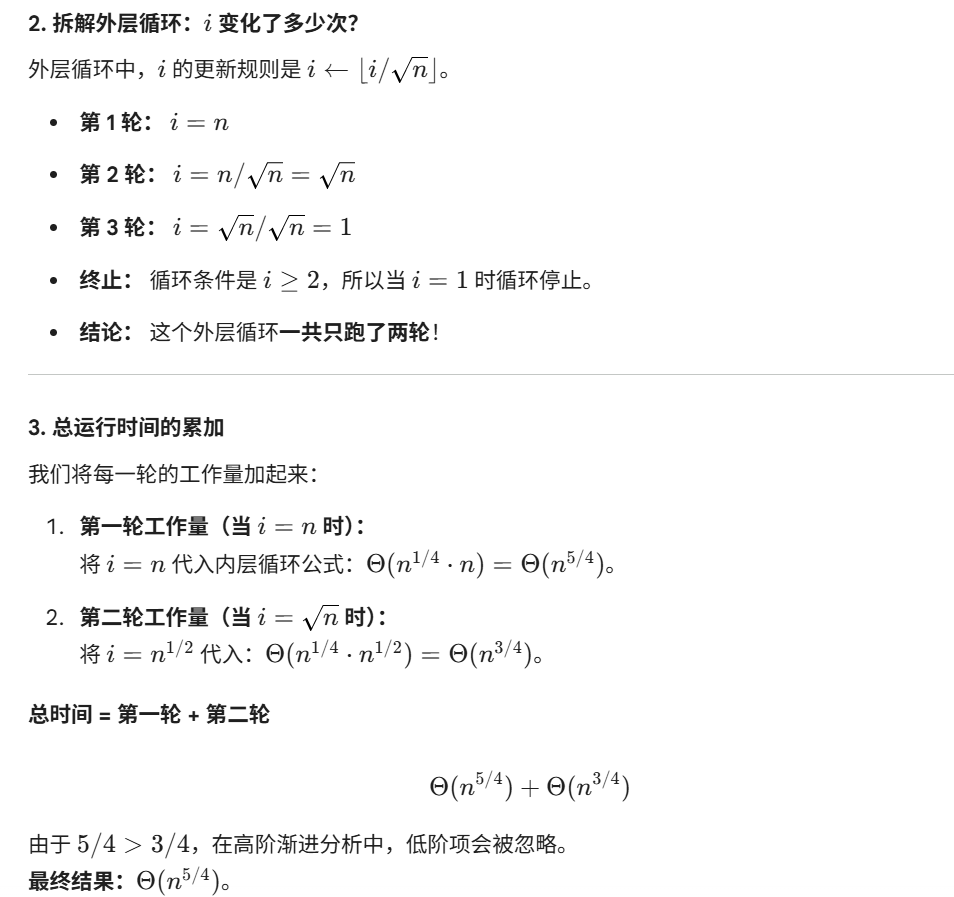

---

### sheet 4

##  1 Algorithm Design
Describe an O(n log n) time algorithm that, given an array A of n integers and another integer x, determines whether or not there are two elements in A whose sum equals x (Hint: Sorting!).

# 解法 1：双指针法（Two Pointers）

这是解题中最优的思路。一旦数组排好序，我们可以在 $O(n)$ 时间内找到结果。

1.  **定位初始点**：找到最接近 $x/2$ 的位置，设置两个指针 $i$ 和 $j$。
    * $i$ 指向小于 $x/2$ 的最大数，向上走（减小索引）。
    * $j$ 指向大于 $x/2$ 的最小数，向下走（增加索引）。
    * *(注：更常见的做法是 $i$ 指向数组开头，$j$ 指向数组末尾)*。

2.  **移动逻辑**：
    * 如果 $A[i] + A[j] = x$：**找到了！** 结束。
    * 如果 $A[i] + A[j] < x$：说明和太小了，需要让大的数更大，所以 $j$ 向右移。
    * 如果 $A[i] + A[j] > x$：说明和太大了，需要让小的数更小，所以 $i$ 向左移。

---

# 解法 2：遍历 + 二分查找（Binary Search）

这个解法更加直截了当，易于编写。

1.  **循环遍历**：用一个 `for` 循环遍历数组中的每一个数 $A[i]$。
2.  **寻找配对**：对于当前的 $A[i]$，我们需要找的目标数是 $target = x - A[i]$。
3.  **二分查找**：在已排序的数组中，利用二分查找去搜索这个 $target$。

### 性能分析：

* 循环跑了 $n$ 次。
* 每次循环里的二分查找耗时 $O(\log n)$。
* **总时间**：$n \times \log n = O(n \log n)$。
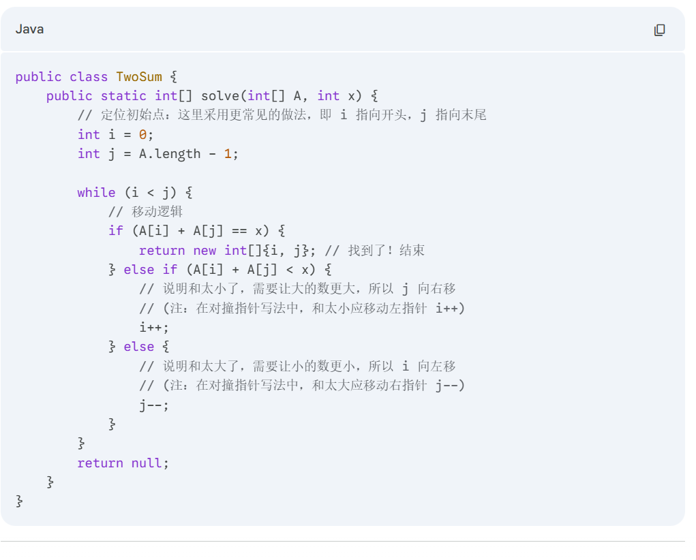
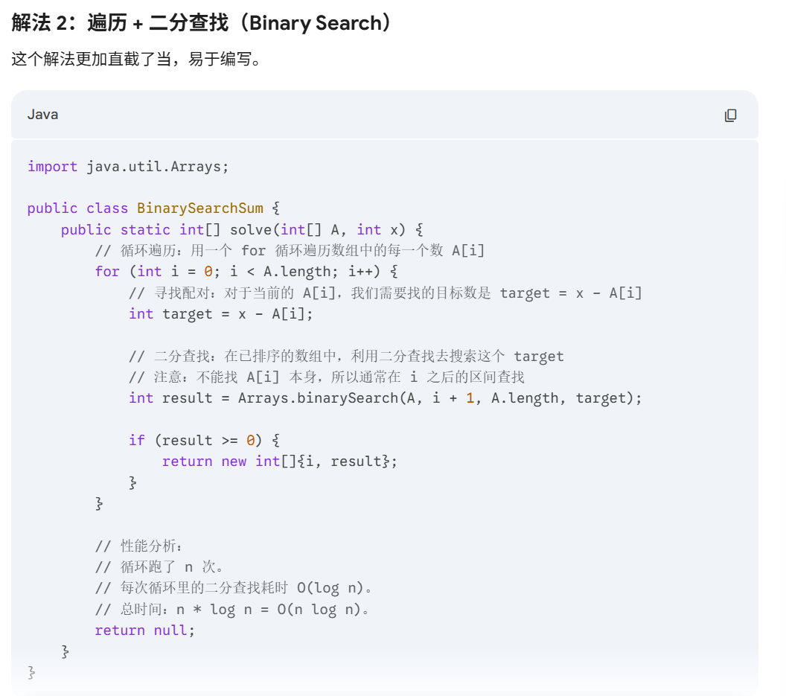

##  2 算法复杂度证明：$O(\log n) \subseteq O(2^{\sqrt{\log n}}) \subseteq O(n)$

# 算法复杂度证明：$O(\log n) \subseteq O(2^{\sqrt{\log n}}) \subseteq O(n)$

### 1. 证明目标
证明上述包含关系成立。根据大 $O$ 符号的定义（取常数 $c=1$），我们只需找到一个 $n_0$，使得对于所有 $n \ge n_0$，满足：
$$\log n \le 2^{\sqrt{\log n}} \le n$$

### 2. 形式转换
利用恒等式 $x = 2^{\log x}$，我们将不等式统一转换为以 2 为底的指数形式：
* $\log n = 2^{\log \log n}$
* $n = 2^{\log n}$

因此，证明原命题等价于证明：
$$\log \log n \le \sqrt{\log n} \le \log n$$

### 3. 证明过程

#### 第一步：证明 $\sqrt{\log n} \le \log n$
这是一个较为简单的代数推导：
$$\sqrt{\log n} \le \log n$$
两边平方得：
$$\log n \le (\log n)^2$$
只要 $\log n \ge 1$（即 $n \ge 2$），该式显然成立。

#### 第二步：证明 $\log \log n \le \sqrt{\log n}$
令 $x = \log n$，我们需要证明 $\log x \le \sqrt{x}$。通过两边平方，这等价于证明：
$$\log^2 x \le x$$
我们使用 **赛道原理 (Racetrack Principle)** 来寻找临界值 $x_0$：

* **验证初始值**：
    当 $x_0 = 16$ 时：$\log^2(16) = 4^2 = 16$。此时等号成立，即 $16 \le 16$。
* **比较导数**：
    我们需要证明当 $x \ge 16$ 时，$(\log^2 x)' \le (x)'$。
    * 右边导数：$(x)' = 1$
    * 左边导数：$(\log^2 x)' = 2 \log x \cdot \frac{1}{x \ln 2}$
    * 即判断：$\frac{2 \log x}{x \ln 2} \le 1 \iff \log x \le \frac{x \ln 2}{2}$

* **再次使用赛道原理**：
    验证 $x = 16$ 时：$\log 16 = 4$，而 $\frac{16 \ln 2}{2} = 8 \ln 2 \approx 8 \times 0.693 = 5.544$。
    因为 $4 \le 5.544$，初始条件成立。
    
    再求导比较：
    * $\frac{d}{dx}(\log x) = \frac{1}{x \ln 2}$
    * $\frac{d}{dx}(\frac{x \ln 2}{2}) = \frac{\ln 2}{2}$
    * 不等式 $\frac{1}{x \ln 2} \le \frac{\ln 2}{2}$ 等价于 $x \ge \frac{2}{\ln^2 2} \approx 4.16$。
    
    由于我们的起始点 $x_0 = 16$ 远大于 $4.16$，导数增长关系成立。

### 4. 结论
通过赛道原理，我们确定当 $x \ge 16$ 时，$\log x \le \sqrt{x}$ 成立。
回到原变量 $n$：
$$\log n \ge 16 \implies n \ge 2^{16} = 65536$$
因此，取 $n_0 = 65536$，对于所有 $n \ge n_0$，不等式 $\log n \le 2^{\sqrt{\log n}} \le n$ 成立。

由此得证：**$O(\log n) \subseteq O(2^{\sqrt{\log n}}) \subseteq O(n)$**。

---

### 3 Mergesort

# 算法分析：当 Merge 操作退化为 $O(n^2)$ 时，归并排序的复杂度变化

如果归并排序（Mergesort）中最核心的“合并（Merge）”操作变慢了，总的时间复杂度会如何变化？我们可以通过 **递归树（Recursion Tree）** 模型来拆解这个数学推导过程。

### 1. 核心背景与变化
* **标准 Mergesort**：每一层的合并操作耗时 $O(n)$，总层数为 $\log n$，所以总时间是 $O(n \log n)$。
* **修改后的 Mergesort**：假设每一层的合并操作退化成了 **$O(n^2)$**。

### 2. 递归树逐层分析
我们要计算递归树中所有节点的工作量总和。

# 第 $i$ 层的情况：
* **节点数量**：第 $i$ 层有 $2^{i-1}$ 个节点（每一层都比上一层翻一倍）。
* **每个数组的长度**：每个节点处理的数组长度大约是 $\frac{n}{2^{i-1}}$。
* **单个节点的工作量**：因为合并操作是平方级别的，所以每个节点耗时：
    $$O\left(\left(\frac{n}{2^{i-1}}\right)^2\right) = O\left(\frac{n^2}{2^{2(i-1)}}\right)$$

#### 第 $i$ 层的总工作量：
将“节点数”乘以“单个节点的工作量”：
$$2^{i-1} \times O\left(\frac{n^2}{2^{2(i-1)}}\right) = O\left(\frac{n^2}{2^{i-1}}\right)$$

---

### 3. 数学求和与等比级数
现在我们将所有层（从 $1$ 到 $\log n + 1$ 层）的工作量相加：
$$\sum_{i=1}^{\log n + 1} O\left(\frac{n^2}{2^{i-1}}\right) = O(n^2) \times \sum_{i=1}^{\log n + 1} \frac{1}{2^{i-1}}$$

**关键数学工具**：这里用到了无穷等比级数公式 $\sum_{j=0}^{\infty} (\frac{1}{2})^j = 2$。

# 推导结论：
括号里的求和项 $1 + \frac{1}{2} + \frac{1}{4} + \dots$ 无论加多少项，其总和永远小于 $2$。
因此：
$$O(n^2) \times

---

### 4 Bubblesort
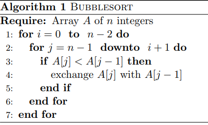
1. What are the worst-case, best-case, and average-case runtimes of Bubblesort?
# 算法复杂度分析：冒泡排序 (Bubblesort)

### 1. 时间复杂度结论
对于该特定版本的冒泡排序，其**最坏情况 (Worst-case)**、**最好情况 (Best-case)** 及 **平均情况 (Average-case)** 的运行时间是相同的：
$$\mathbf{O(n^2)}$$

---

### 2. 详细证明与推导

#### 核心观察：
我们发现算法中第 3 行和第 4 行的操作执行次数与输入数据的初始状态**无关**。
* 外层循环始终从 $0$ 执行到 $n-2$。
* 内层循环始终从 $n-1$ 递减到 $i+1$。

因此，无论数组是已经排好序的，还是完全倒序的，循环执行的次数都保持一致。

#### 数学推导：
交换两个元素的操作（第 4 行）耗时为 $O(1)$。总运行时间由该操作的执行总次数决定。我们通过求和公式进行计算：

$$\sum_{i=0}^{n-2} \sum_{j=i+1}^{n-1} O(1) = O(1) \cdot \sum_{i=0}^{n-2} \sum_{j=i+1}^{n-1} 1$$

**第一步：计算内层求和（即内层循环的次数）**
根据连续整数个数公式（上界 - 下界 + 1）：
$$(n - 1) - (i + 1) + 1 = n - i - 1$$

**第二步：代入外层求和**
$$O(1) \cdot \sum_{i=0}^{n-2} (n - i - 1)$$

**第三步：展开求和式**
利用分配律，将常数项与变量项分开：
$$O(1) \cdot \left( (n - 1)^2 - \sum_{i=0}^{n-2} i \right)$$

**第四步：利用等差数列求和公式**
已知 $\sum_{i=0}^{k} i = \frac{k(k+1)}{2}$，此处 $k = n-2$：
$$O(1) \cdot \left( (n - 1)^2 - \frac{(n - 2)(n - 1)}{2} \right)$$

**第五步：不等式放缩与结论**
由于 $\frac{(n - 2)(n - 1)}{2} \le \frac{(n-1)^2}{2}$，我们可以得出：
$$\le O(1) \cdot \frac{(n-1)^2}{2} = \mathbf{O(n^2)}$$

## 2. Consider the loop in lines 2 − 6. Prove that the following invariant holds at the beginning of the loop: A[j] ≤ A[k], for every k ≥ j . Give a suitable termination property of the loop.

# 冒泡排序证明：内层循环不变式 (Loop Invariant)

### 1. 证明目标
针对算法中第 2 - 6 行的内层循环，证明在循环开始时，以下性质（不变式）始终成立：
> 对于每一个 $k \ge j$，满足 $A[j] \le A[k]$。

此外，给出该循环的终止属性（Termination property）。

---

### 2. 证明过程

#### **初始化 (Initialization)**
我们需要证明在循环第一次迭代之前，该性质为真。
* 设定 $j = n - 1$。
* 此时属性转化为：对于每一个 $k \ge n - 1$，满足 $A[n - 1] \le A[k]$。
* 由于在数组边界内，满足 $k \ge n - 1$ 的唯一值只有 $k = n - 1$。
* 显然 $A[n - 1] \le A[n - 1]$ 成立。
* **结论**：初始状态性质成立。

#### **保持 (Maintenance)**
假设在某次迭代 $j$ 开始前，性质成立（即 $A[j] \le A[k]$ 对于所有 $k \ge j$ 成立）。我们需要证明在进入下一次迭代（此时 $j$ 值减小）前，性质依然保持。

在当前迭代中，根据算法逻辑，存在两种情况：

* **情况 1：$A[j] \ge A[j - 1]$**（即 `if` 条件为假）
    * 数组元素不发生交换。
    * 我们已知 $A[j] \le A[k]$ 对于所有 $k \ge j$ 成立。
    * 既然 $A[j - 1] \le A[j]$，根据传递性，$A[j - 1] \le A[k]$ 对于所有 $k \ge j - 1$ 均成立。
    * **结论**：循环不变式在下一次迭代前依然成立。

* **情况 2：$A[j] < A[j - 1]$**（即 `if` 条件为真）
    * $A[j]$ 与 $A[j - 1]$ 进行交换。
    * 我们需要证明交换后，新的 $A[j - 1] \le A[k]$ 对于所有 $k \ge j - 1$ 成立：
        1. 对于 $k = j - 1$：显然 $A[j - 1] \le A[j - 1]$。
        2. 对于 $k = j$：由于发生了交换，现在的 $A[j - 1]$ 是原先较小的 $A[j]$，因此满足 $A[j - 1] \le A[j]$。
        3. 对于所有 $k \ge j + 1$：根据初始的循环不变式，原先的 $A[j]$ 小于等于这些位置的所有元素，交换后这一关系依然保持。

#### **终止 (Termination)**
当内层循环终止时，我们可以获得如下保证：
> **对于每一个 $k \ge i$，均有 $A[i] \le A[k]$。**

## 3. Consider now the loop in lines 1 − 7. Prove that the following invariant holds at the beginning of the loop: The subarray A[0, i] is sorted and A[0, i − 1] consists of the i smallest elements of A. Give a suitable termination property that shows that A is sorted upon termination.

# 冒泡排序证明：外层循环不变式 (Outer Loop Invariant)

本文档旨在通过循环不变式（Loop Invariant）证明冒泡排序（Bubblesort）外层循环（第 1 - 7 行）的正确性。

---

### 1. 证明目标

证明在每一轮外层循环开始时，以下性质始终成立：
> 子数组 $A[0 \dots i]$ 是有序的，且 $A[0 \dots i-1]$ 包含了整个数组中最小的 $i$ 个元素。

同时给出**终止属性（Termination property）**，证明算法结束时整个数组 $A$ 已完成排序。

---

### 2. 证明过程

#### **初始化 (Initialization)**
我们需要证明在循环第一次迭代之前（即 $i = 0$ 时），该性质为真。
* **状态描述**：当 $i = 0$ 时，性质转化为：“子数组 $A[0 \dots 0]$ 是有序的，且 $A[0 \dots -1]$ 包含了数组中最小的 $0$ 个元素”。
* **证明**：
    * $A[0 \dots 0]$ 仅包含单个元素 $A[0]$，单元素数组必然是有序的。
    * $A[0 \dots -1]$ 是一个空数组，逻辑上“包含最小的 0 个元素”自然成立。
* **结论**：初始状态下，循环不变式成立。

#### **保持 (Maintenance)**
假设在某次迭代 $i$ 开始前，性质成立（即 $A[0 \dots i-1]$ 是前 $i$ 个最小元素且有序）。我们需要证明在进入下一次迭代（即 $i$ 变为 $i+1$）前，性质依然保持。

1.  **利用内层循环结论**：根据内层循环不变式的终止属性，当内层循环（第 2 - 6 行）结束时，保证了 $A[i] \le A[k]$ 对于所有 $k \ge i$ 成立。这意味着 **$A[i]$ 是当前剩余子数组 $A[i \dots n-1]$ 中的最小值**。
2.  **逻辑组合**：
    * 已知 $A[0 \dots i-1]$ 已经是数组中最小的 $i$ 个元素且有序。
    * 此时内层循环将剩余部分中最小的元素放到了位置 $A[i]$。
    * 因此，$A[0 \dots i]$ 现在包含了全数组中最小的 $i+1$ 个元素。
    * 由于 $A[i]$ 大于等于前缀 $A[0 \dots i-1]$ 中的所有元素，整个前缀 $A[0 \dots i]$ 依然保持有序。
* **结论**：当 $i$ 增加到 $i+1$ 进入下一轮迭代时，不变式依然成立。

#### **终止 (Termination)**
外层循环在执行完 $i = n-2$ 后终止。
* **状态描述**：此时迭代变量达到临界值，根据循环不变式，子数组 $A[0 \dots n-1]$ 是有序的。
* **证明结论**：由于整个数组的长度为 $n$，子数组 $A[0 \dots n-1]$ 涵盖了数组的所有元素。这保证了在算法结束时，整个数组 $A$ 已经完全排好序。

---

### 💡 总结
这个证明展示了冒泡排序的本质：每一轮外层循环通过内层循环的“冒泡”过程，确立一个新的最小值位置，从而像搭积木一样由左至右构建出最终的有序数组。