Transistors and logic gates
Combinatorial logic 
Sequential logic

Verilog 
1,design:   write verilog code
2,Functional Verification:  run in the computer, check the logic 
3,synthesis(合成):  它把你写的代码转换成门级网表 (Netlist)。
4,Place and Route: 就像软件里的 Linking 这里是物理上的连线。
5,Manufacture (制造): 交给像台积电(TSMC)这样的工厂，把电路印在硅片上。
6,testing
-----------------------------------------------------------------------------------------------------
            C 语言 (软件)	     Verilog (硬件)	                     核心区别
基本单位	Function (函数)	       Module (模块)	         函数是执行一段逻辑；模块是一个具体的电路块。
层级引用	Call (调用)	          Instantiation (实例化)	 调用是临时的；实例化是永久的（焊死在电路板上）。
数据载体	Variable (变量)	      Net (网线/连线)	         变量是内存里的存储单元；网线是物理上的导线。
运行状态	Transient (瞬时的)	  Permanent (永久的)	     函数运行完就没了；硬件模块一旦通电就一直在那里。
-----------------------------------------------------------------------------------------------------
（full adder）example:

module fa( output wire co ,        构造完图片为 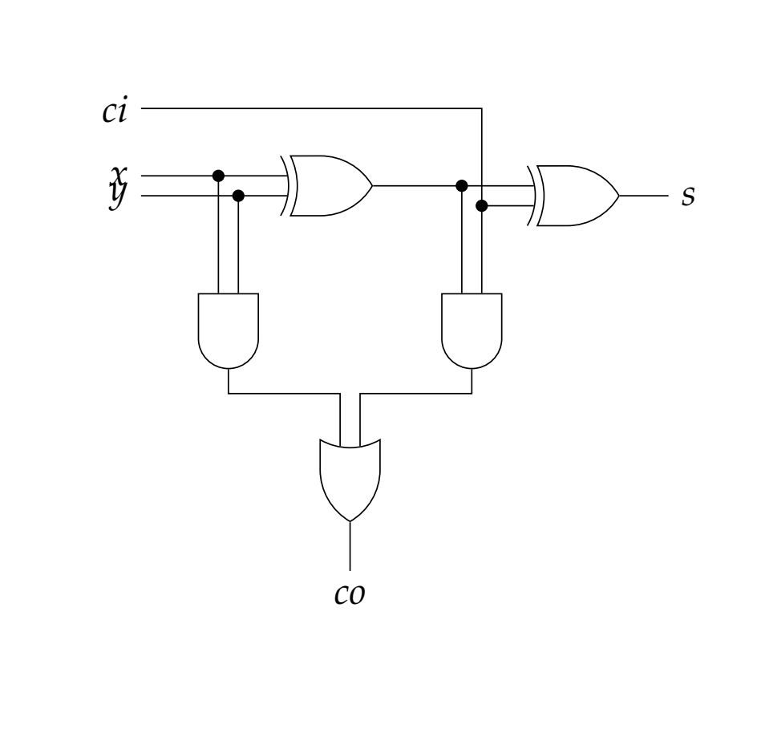 《command + shift + v放大》
output wire s,
input wire ci ,
input wire x,
input wire y );

wire w0 , w1 , w2;  
xor t0( w0 , x, y );  --图中最左上角的 XOR 门。它把x和y异或，结果存在内部电线 w0 上。
and t1( w1 , x, y );  --图下方的第一个 AND 门。它计算如果x和y都是 1，是否会产生进位，结果存在 w1。
xor t2( s, w0 , ci ); --右上角的 XOR 门。它把 w0 和进位ci再次异或，得到最终的求和结果s。
and t3( w2 , w0 , ci ); --中间的 AND 门。
or t4( co , w1 , w2 ); --最后那个盾牌形状的 OR 门。只要 w1 或 w2 有一个为 1，进位co就会输出 1。
endmodule

x, y: 当前位的两个加数。
ci (Carry-in): 来自低位的进位。
s (Sum): 当前位的加法结果。
co (Carry-out): 产生给高位的进位。    
net：wire w0, w1, w2
instance name: t0, t1, t2, t3, t4
-----------------------------------------------------------------------------------------------------
switch level:

pull up network (PMOS)
pull down network (NMOS)

pmos( t, VDD, b ); —— 晶体管连接电源VDD和中间点t，受b控制。
pmos( a, t, c );   —— 晶体管连接t 和输出a，受c控制。
nmos( a, VSS, c ); —— 受c控制，若c=1，将a拉低到地线VSS。
nmos( a, VSS, b ); —— 受b控制，若b=1，将a拉低到地线VSS。
~ (b V c)
-----------------------------------------------------------------------------------------------------
wire and wire vectors                                             
• wire w ⇒ an internal 1-bit wire w                       msb and lsb:  
• wire [ 3 : 0 ] x ⇒ an internal 4-bit wire vector x       [3:0] 表示索引从3到0 即 MSB 是 bit 3，lsb是 bit 0.        
• input wire [ 3 : 0 ] y ⇒ an input 4-bit wire vector y
• output wire [ 3 : 0 ] z ⇒ an output 4-bit wire vector y
-----------------------------------------------------------------------------------------------------
values
0：逻辑 0 / 低电平 / False。
1：逻辑 1 / 高电平 / True。
X：未知状态 (Unknown)。通常出现在未初始化的寄存器，或者两个不同的信号同时驱动一根导线（冲突）时。
Z：高阻态 (High Impedance)。相当于断开连接，常用于三态门（Tri-state buffer）。
-----------------------------------------------------------------------------------------------------
the 4-state logic
0 (Logical False)：低电平，接地。
1 (Logical True)：高电平，接电源。
X (Unknown)：未知状态。
表示既不是 0 也不是 1。
Z (High Impedance)：高阻态。

2'b10: 2：位宽为2bit    b：二进制（binary）  10：二进制的值。
1'bX：定义一个 1 位宽的二进制数，其值是未知的
4'b10XZ：这是一个 4 位的向量。| MSB (最高位) 是 1。| 次高位是 0。| 次低位是 X (未知)。| LSB (最低位) 是 Z (高阻态)
-----------------------------------------------------------------------------------------------------
 //第一个参数永远是输出（Output），后面的参数全是输入（Inputs）。 //（r,x,y）r 是输出结果,x和y是输入信号.  
buf  缓冲器 (Buffer) t0(r, x); ↦→ r = x          
not t1( r, x ); ↦→ r = ¬x                                 
nand t2( r, x, y ); ↦→ r = ～（x ∧ y）                       
nor t3( r, x, y ); ↦→ r = ～（x ∨ y）     
and t4( r, x, y ); ↦→ r = x ∧ y
or t5( r, x, y ); ↦→ r = x ∨ y
xor t6( r, x, y ); ↦→ r = ～（x ⊕ y）
-----------------------------------------------------------------------------------------------------
两个例子

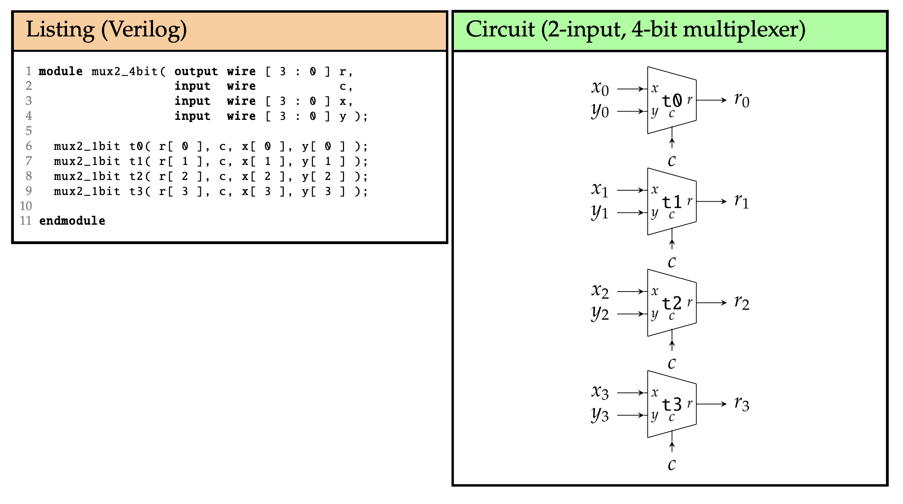
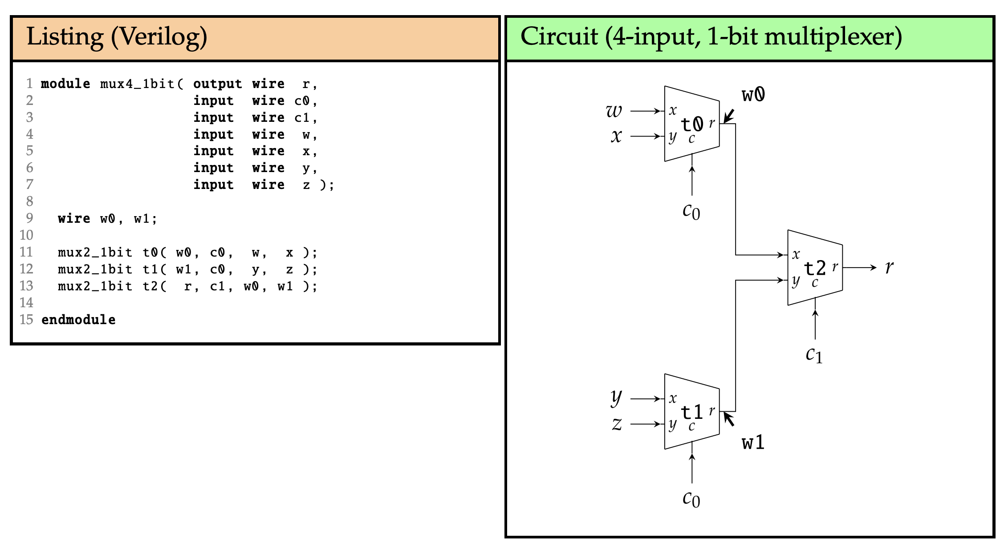

assign：
assign r = c1 ? ( c0 ? z : y ) : ( c0 ? x : w );
？：如果 c1 为 1，看括号左边；如果 c1 为 0，看括号右边
-----------------------------------------------------------------------------------------------------
reg（Register）是 Verilog 中用于存储数值的数据类型
always @( x )：电平触发。只要 x 发生变化（0变1或1变0），块内代码就运行一次。
always @( posedge x )：上升沿触发。只有在 x 从 0 变为 1 的瞬间触发。这是实现**时序逻辑（寄存器、计数器）**的标准方法。
always @( negedge x )：下降沿触发。只有在 x 从 1 变为 0 的瞬间触发。

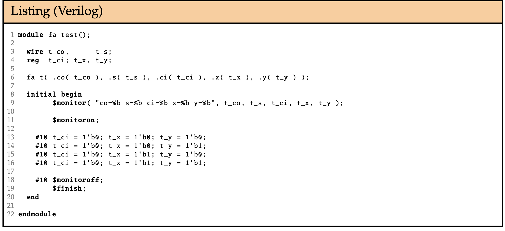
第 1 行：module fa_test(); 定义了一个名为 fa_test 的测试模块。
第 3 行：wire t_co, t_s; 声明了两个连线信号。它们用于接收被测试模块（全加器）的输出结果。
第 4 行：reg t_ci; t_x, t_y; 声明了三个寄存器信号。在测试脚本中，我们需要用 reg 来主动“驱动”输入信号的值。
第 6 行：fa t( .co( t_co ), .s( t_s ), .ci( t_ci ), .x( t_x ), .y( t_y ) );
这里创建了一个全加器模块 fa 的实例，并命名为 t。
第 8 行：initial begin 标志着仿真激励的开始。此块内的代码在仿真启动时仅执行一次
第 9 行：$monitor( ... ); 设置一个系统任务。只要括号内的任何信号发生变化，它就会自动打印出信号的当前值。
第 11 行：$monitoron; 启动监控功能
第 13 行：#10 t_ci = 1'b0; t_x = 1'b0; t_y = 1'b0;
第 14-16 行：每隔 10 个时间单位，改变一次输入组合（如 001, 010, 011），以此遍历全加器的各种工作情况。
第 18 行：#10 $monitoroff; 等待最后 10 个单位后关闭监控。
第 19 行：$finish; 告诉仿真器停止运行并退出。
-----------------------------------------------------------------------------------------------------
确定性有限状态机 (Deterministic Finite State Machine, DFSM)      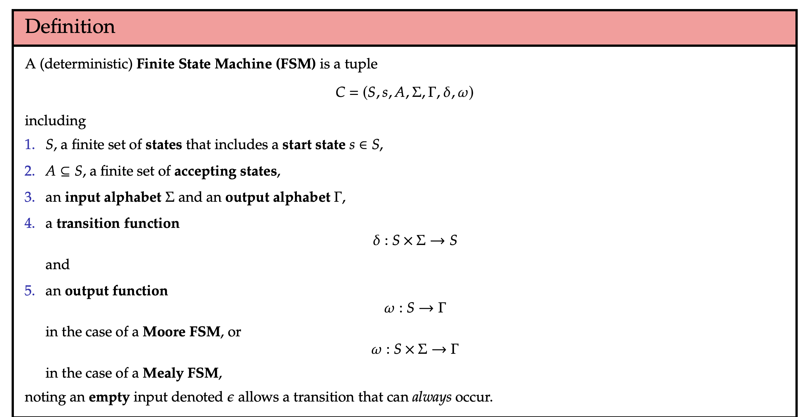
(States)：所有可能状态的集合（比如：{开, 关}）。
(Start State)：机器开始时的初始状态。
(Accepting States)：接受状态集合。如果运行结束停在这里，任务就完成了。
(Input Alphabet)：机器能读懂的符号（比如：{0, 1}）。
(Output Alphabet)：机器能吐出来的符号（比如：{Yes, No}）。
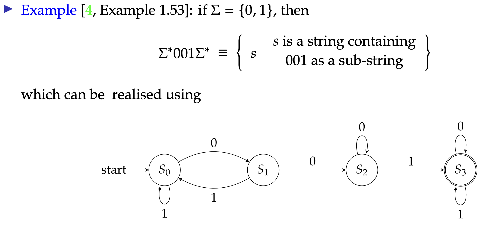
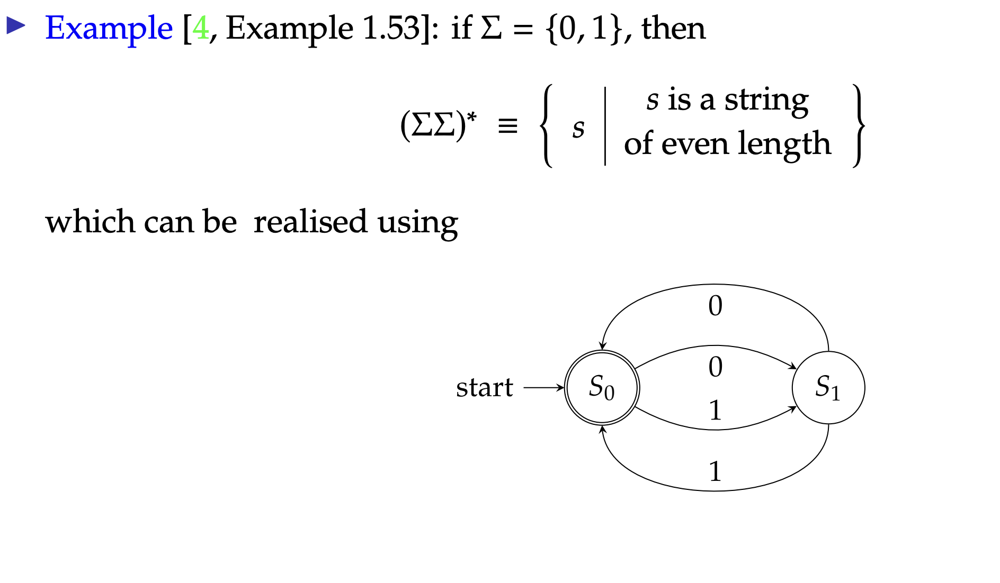
$1^*(01^+)^*$：$1^*$：开头可以有任意数量的 1（或者没有）。$(01^+)^*$：这一部分是核心约束。它要求如果出现了 0，后面必须跟着 $1^+$（即至少一个 1），并且这个组合可以重复多次。
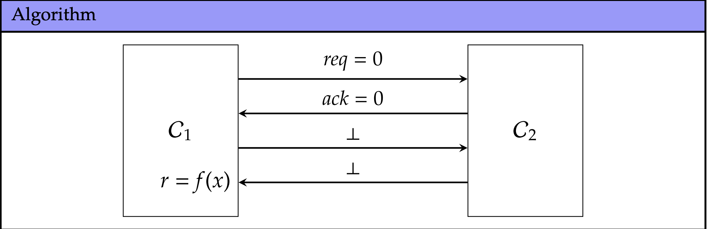
req (Request, 请求信号)：由 $C_1$ 发给 $C_2$。当 $C_1$ 把数据准备好放在数据线上时，把 req 置为 1，告诉 $C_2$：“喂，开工了！”
ack (Acknowledge, 确认信号)：由 $C_2$ 发回给 $C_1$。当 $C_2$ 完成计算并将结果 $r$ 准备好时，把 ack 置为 1，告诉 $C_1$：“报告，算完了，你可以拿走了。”$\bot$ (底元素符号)：在图中指向数据传输的方向（从 $C_1 \to C_2$ 是输入 $x$，从 $C_2 \to C_1$ 是结果 $r$）。数学上这常代表“无数据”或“未定义”，在硬件图中通常指代实际传输的数据总线
-----------------------------------------------------------------------------------------------------
ASCC and EDVAC
CPU(中央处理器) ：state 状态 IR（instruction register）：存放正在执行的指令  A（accumulator）："草稿纸" 完成加减法运算  PC (Program Counter)
MEM（data）：存放数据
TAPE（instruction）：之所以叫 TAPE（纸带），是因为早期的哈佛架构机器（如 Harvard Mark I）确实是用打孔纸带读指令的。

计算10加20的例子： 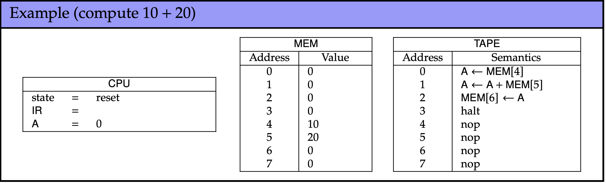  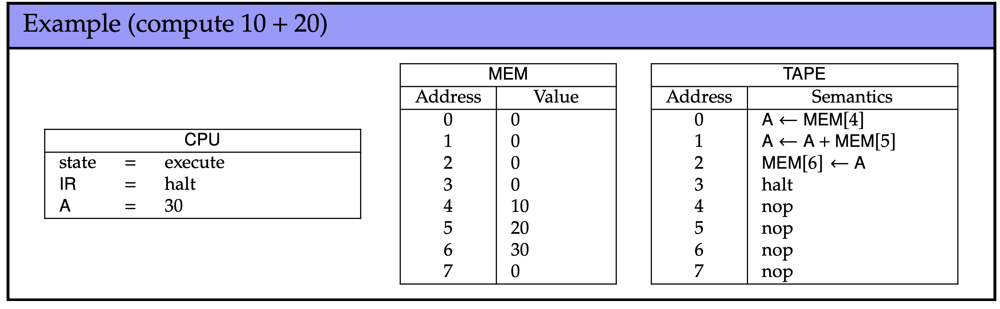 reset开始 fetch抓取 Decode译码 execute执行
MEM地址 4 存着数字 10，地址 5 存着数字 20，通过tape将10+20的结果放在MEM[6],halt(停机)

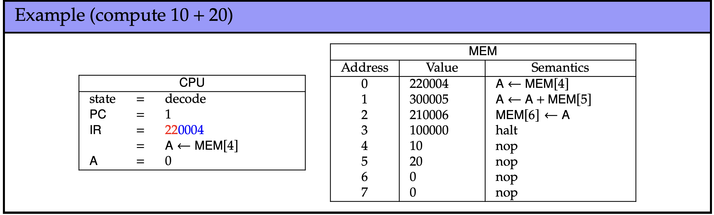
address【0】的value是由两部分组成：Opcode：22（到22这个数字CPU就会开启）， Operand/Address：0004

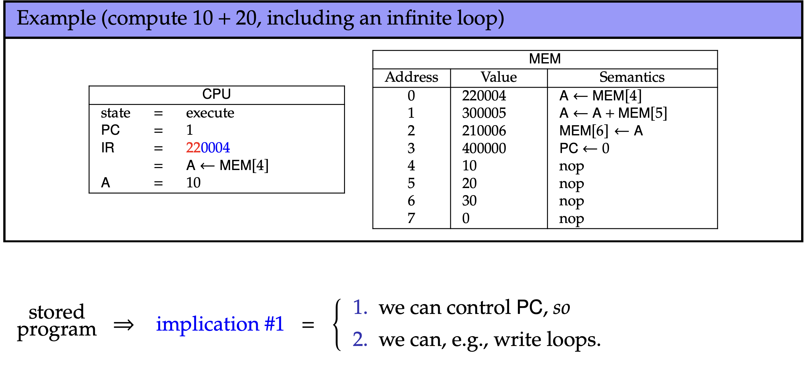
可以把PC的指令改为0，这样就可以一直循环

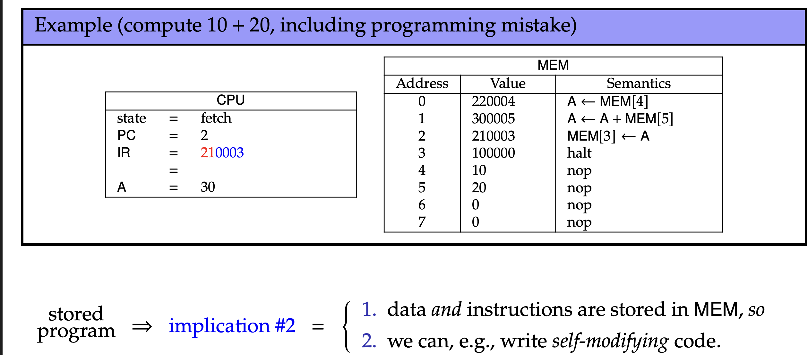
覆盖指令：重点来了！地址 3 本来存的是 100000 (halt，停机指令)。现在，这个“停机”指令被数字 30 抹掉了。
-----------------------------------------------------------------------------------------------------
tb1 end: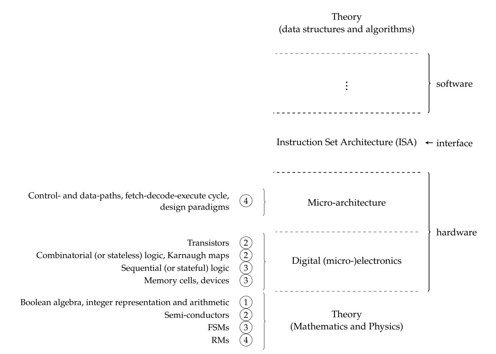
-----------------------------------------------------------------------------------------------------
Hex 8
ISA(instruction set architecture) define: wordside , instruction , state(eg: registers, memory) , execution model

All instructions are 8 bit.(4 bits opcode: representing an operation.)(4 bit operand: representing data.)
--$2^4 = 16$，意味着这个处理器最多只能识别 16 种不同的动作（如加法、跳转等）。

The processor state is represented by four 8-bit registers.
pc (Program Counter)
oreg (Operand Register)
areg(Accumulator A) :Left-hand operand and result of arithmetic.
breg (Register B):Right-hand operand.

The execution cycle has 3-stages: Fetch(从内存中读取 pc 指向的指令。), 
Increment PC(pc = pc + 1), 
Execute译码并完成操作（例如让 areg 加 breg）.

Four classes of instruction:
▶ Data access: 9 instructions.  读写内存，寄存器之间搬运数据
▶ Branching, jumping and calling: 4 instructions.  实现 if 语句、循环和函数调用
▶ Expression evaluation: 2 instructions.  数学运算
▶ Prefix (special): 1 instruction.

nine of the sixteen instructions:
ADD |   areg ← areg + breg          | add registers and store in areg
SUB |   areg ← areg − breg          | subtract registers and store in areg
LDAC| areg ← oreg                   | load constant into areg
LDBC| breg ← oreg                   | load constant into breg
LDAP| areg ← pc + oreg              | load address in program
BR  | pc ← pc + oreg                | branch relative unconditional
BRZ |if areg = 0 then pc ← pc + oreg| branch relative zero
BRN |if areg < 0 then pc ← pc + oreg| branch relative negative
BRB |pc ← breg                      | branch absolute

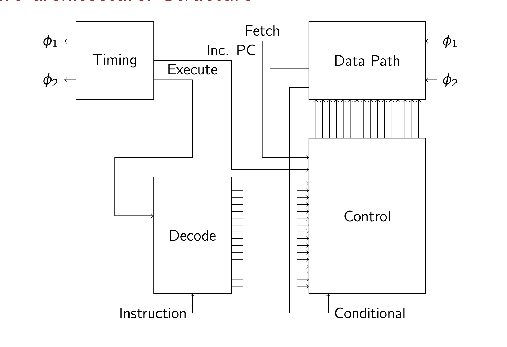
structure
1. Timing
$\phi_1$ 和 $\phi_2$： 这是双相时钟信号（Two-phase clocking）。它们确保信号在电路中稳定传输，防止竞争冒险。
阶段控制： 它输出三个核心使能信号：
Fetch： 触发从内存读取指令。
Inc. PC： 触发程序计数器自增。
Execute： 触发最终的操作执行。

2. Decode: 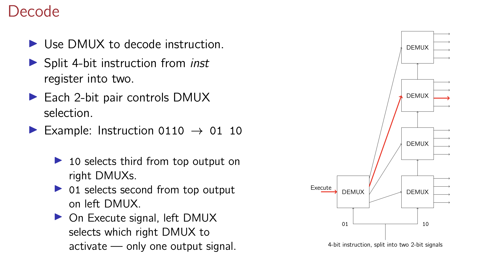
指令 (Instruction)： 来自译码单元（Decode），告诉它当前是什么操作（如 ADD 或 BR）。
阶段 (Stage)： 来自时序单元（Timing），告诉它现在是 Fetch、Inc PC 还是 Execute 阶段。
条件 (Condition)： 只有在执行跳转指令（如 BRZ 或 BRN）时才起作用，由数据通路返回 $areg$ 的状态。
3. Control
4. Data Path: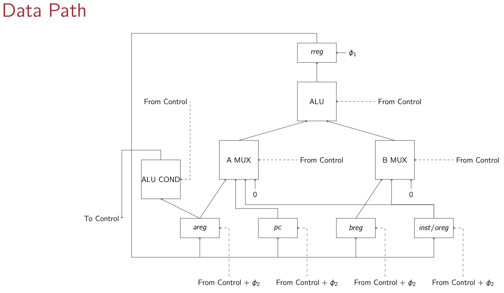
▶areg & breg： 作为 ALU 的主要输入。
▶pc (程序计数器)： 用于计算相对跳转地址（如 pc + oreg）。
▶inst/oreg： 存放当前指令或操作数。
▶A MUX 和 B MUX 根据控制单元的信号选择哪一组数据进入 ALU 进行运算
▶ALU (算术逻辑单元)： 接收来自两个 MUX 的数据，执行 ADD 或 SUB 等操作。
▶rreg (结果寄存器)
▶ALU COND:它会将“结果是否为零”或“结果是否为负”的信息传回控制单元    BRZ（为零跳转）和 BRN（为负跳转）

ISA State: Registers
寄存器是 CPU 内部极快的小型存储单元。它们分为两大类：
通用寄存器 (General-purpose registers)： 软件可以自由控制，用于执行典型的指令（如加法、搬运数据） 。一组通用寄存器被称为寄存器堆 (Register file) 。
专用寄存器 (Special-purpose registers)： 具有特定功能，通常只能通过特殊指令访问 。常见的例子包括：
程序计数器 (PC)： 存放下一条待执行指令的地址 。
指令寄存器 (Instruction Register)： 存放当前正在执行的指令 。
状态寄存器 (Status Register)： 记录处理器状态（如计算结果是否为负、是否溢出），可影响程序分支 。
堆栈指针 (Stack Pointer)： 指向内存中栈顶的地址 。

ISA State: Memory
(Address space) 定义了程序可以访问的内存地址范围 。
addressability | How many bits do we need to access elements of memory?
granularity    | What does each address refer to? E.g., byte-addressible if each element of the address space is a byte (8-bit word).
alignment      | For n-byte word at address x, if x ≡ 0 mod n then x is aligned. Is unaligned access allowed?
endianness     | For an n-byte word, what order do we store the bytes in each word. E.g., w = ⟨w0,w1, . . . ,wn−1⟩
little-endian  | “left-to-right”, with the first bytes stored at lower memory addresses.
big-endian     | “right-to-left“, with the last bytes stored at lower memory addresses.

1. 指令的结构与语义 (Structure & Semantics)
指令是程序员控制处理器的基本单位，改变着机器的“状态”。每一条指令通常包含两个核心部分：
操作码 (Opcode)： 决定执行什么操作（例如：加法、读取内存）。
操作数 (Operand)： 决定操作的对象。操作数可以是立即数（硬编码的数值）、寄存器或内存地址。
语义定义： 描述指令具体的行为。例如 add r0, r1, r2 的语义是 GPR[0]←GPR[1]+GPR[2]。

2. 指令编码：固定长度 vs 变长
设计 ISA 时，最重大的决策之一是如何在内存中表示这些指令：
特性	固定长度编码 (Fixed Length)	变长编码 (Variable Length)
定义	所有指令长度相同（如 MIPS 是 32-bit）	指令长度根据需求变化（如 x86 是 1-15 字节）
优点	易于取指和译码，硬件设计简单	代码密度高，节省存储空间
缺点	浪费空间（代码密度低），编码压力大	硬件译码极其复杂（不知道下一条指令从哪开始）
例子	Hex 8 (8-bit), MIPS32	Intel IA-32 (x86)
-----------------------------------------------------------------------------------------------------
Arithmetic Logic Unit（多功能组合逻辑电路）
Adder-subtractor
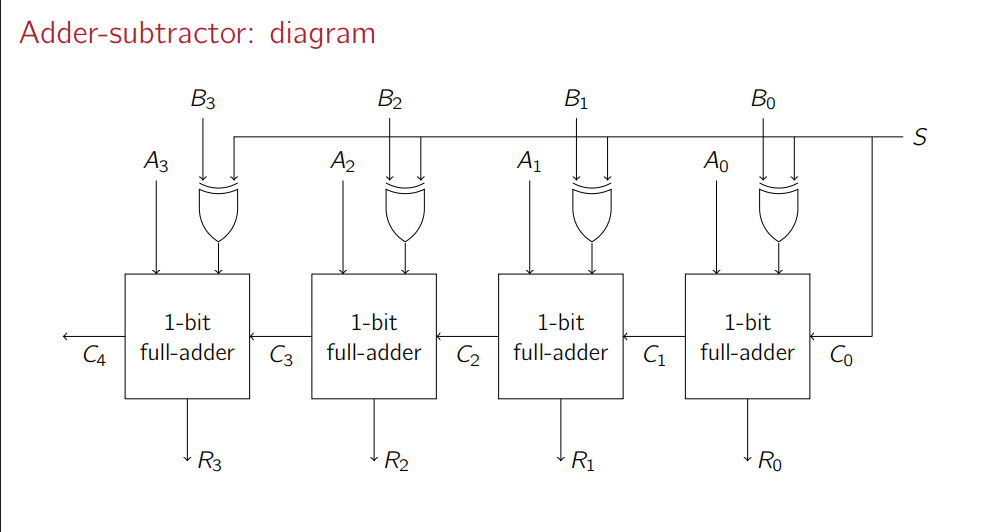
输入： A组 (A_3到A_0) 直接输入全加器；B组 (B_3到B_0) 经过 XOR 处理后输入。
结果 R_3 到 R_0 是计算出的数值。
进位/借位： C_4是最高位的进位。在有符号数运算中，它常被用来辅助判断是否发生了溢出(Overflow)。

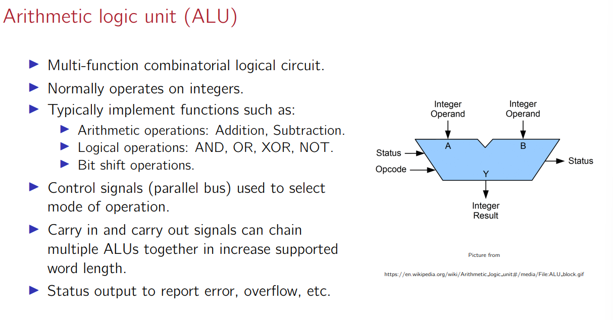
ALU ：Arithmic(Addition·Subtraction), logical（and, or, nand, nor）, Bit shift(移动)

Two's complement (i + −i = 2^n)
2^n 在n位寄存器中会产生进位并被丢弃，结果表现为 0
invert将所有位0变1，1变0（得到一阶补码/反码）。
Add 1 ： 在最低位加 1。

overflow(溢出)
c_in != c_out (发生了overflow)
c_in = c_out （计算结果有效）
eg: 6+3
6补码（0110） 3补码（0011） 结果为（1001）(-7) overflow

4 位 ALU 的控制逻辑表
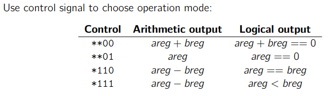
-------------------------------------------------------------------------------------
Texas Instruments 74181 ALU 芯片
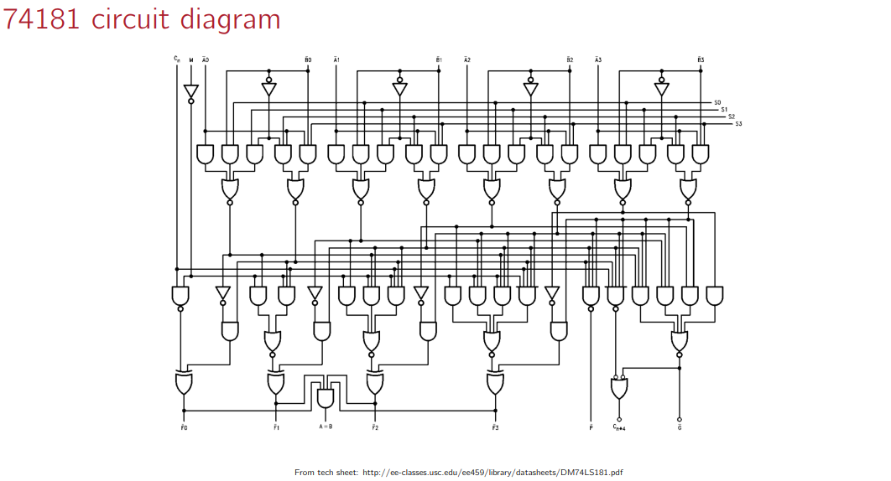
接收两个 4 位操作数（A 和 B），输出一个 4 位结果。
M (Mode selector)：
M = 1：逻辑模式 (Logic)。此时进位链被封锁，位与位之间互不影响。
M = 0：算术模式 (Arithmetic)。此时进位链开启，处理加减法。
S3, S2, S1, S0 (Function Select)： 这 4 位信号组合起来决定具体执行哪一种操作（共 $2^4 = 16$ 种）。
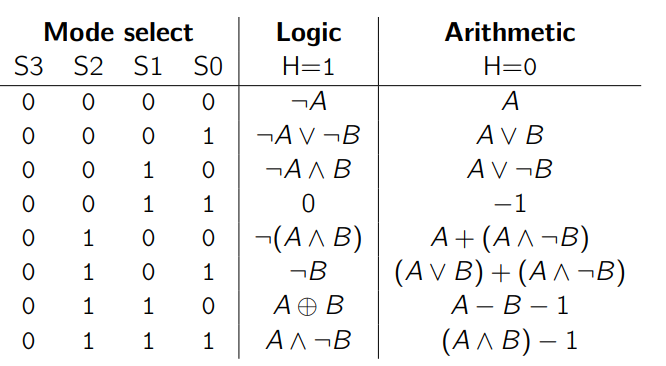
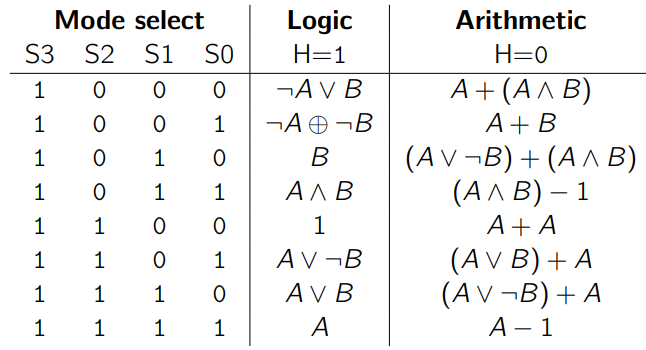
------------------------------------------------------------------------------------
两种查找模式（addressing modes）
决定了指令如何解释操作数（Operands），即 CPU 如何找到它需要处理的数据 。
$GPR[i]$：指代第 $i$ 个通用寄存器 
$MEM[i]$：指代内存中地址为 $i$ 的位置 。

Immediate Mode
定义：操作数就是数据本身 。
ARM 语法：使用 # 前缀（如 #1）
例子：add r0, r1, #1 等同于 $GPR[0] <- GPR[1] + 1$ 。

direct mode
定义：操作数是数据的地址 。
寄存器直接寻址：数据就在寄存器中（如 ARM 中的 r1） 。
内存直接寻址：指令直接给出内存地址 。

indirect mode
定义：操作数是“地址的地址”，即寄存器里存的是内存门牌号 。
ARM 语法：使用中括号 []（如 [r1]） 。
逻辑：add r0, [r1], #1 等同于 $GPR[0] <- MEM[GPR[1]] + 1$ 。

Indexed Mode
定义：通过 基址 + 偏移量 (Address + Offset) 来计算最终地址 。
应用场景：访问结构体（Struct）成员 。
ARM 语法：ldrb r2, [r0, #1]（基址寄存器 r0 + 偏移量 1） 。

Auto-indexed Mode
定义：在变址寻址的基础上，访问完数据后自动更新基址或偏移量 。
应用场景：循环遍历数组 。
ARM 术语：称为“后变址”（Post-indexed），如 ldrb r2, [r1], #1 表示先取值，再将 r1 加 1 。
------------------------------------------------------------------------------------
Contorl Flow
定义：描述指令执行顺序的术语，本质上是程序计数器 (PC) 的更新方式 。
隐式更新 (Implicit)：作为执行周期（Fetch-Decode-Execute）的一部分自动发生，通常指向下一条相邻指令 。
显式更新 (Explicit)：通过特定指令（如分支/跳转）修改 PC 寄存器的值 。
应用场景：实现高级语言中的 if 条件判断、while/for 循环以及函数调用 。

分支指令分类 (Branching)
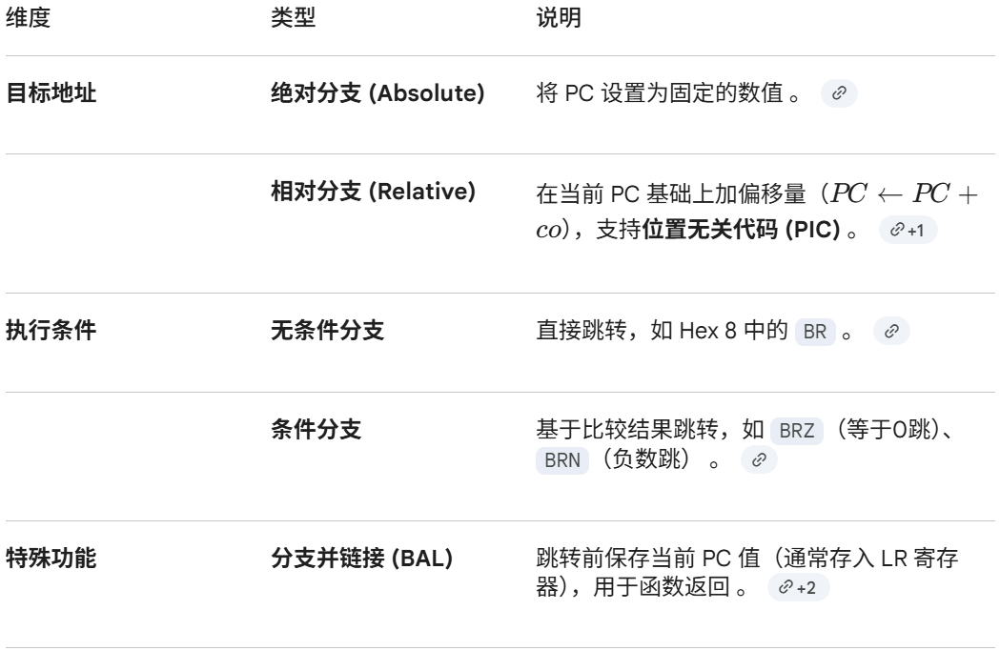

处理器硬件实现：
控制通路 vs 数据通路数据通路 (Datapath)：更新处理器状态的硬件集合，包含寄存器、ALU（算术逻辑单元）、内存及其连接线路 。
控制通路 (Control path)：根据指令发出控制信号，决定数据通路中哪些部分处于活动状态，使电路具备“可编程性” 。

控制单元 (Control Unit) 的两种实现 ：
硬连线控制 (Hardwired)：由固定的逻辑门（如与门、或门）实现，速度快但硬件一旦制造便无法更改 。
微程序控制 (Micro-programmed)：将复杂指令分解为一系列底层“微指令”并存入 ROM 。
优点：设计更易修改，可通过更新固件修复硬件漏洞（如针对 Spectre/Meltdown 的补丁） 。
------------------------------------------------------------------------------------
 Arm and x86
 ARMv7-A 架构特性 (RISC)
 x86 架构特性 (CISC)
------------------------------------------------------------------------------------
pipeline and Hazards

A typical RISC architecture operates in these five stages:
Fetch Get an instruction from memory.
Decode Decode instruction and read operands from registers.
Execute Execute instruction or calculate memory addresses.
Memory Access memory (loads/stores).
Writeback Save results back to the registers.
流水线气泡 (Bubbles/Stalls)：由于某些阶段延迟或冲突导致的流水线停顿 。

CPI
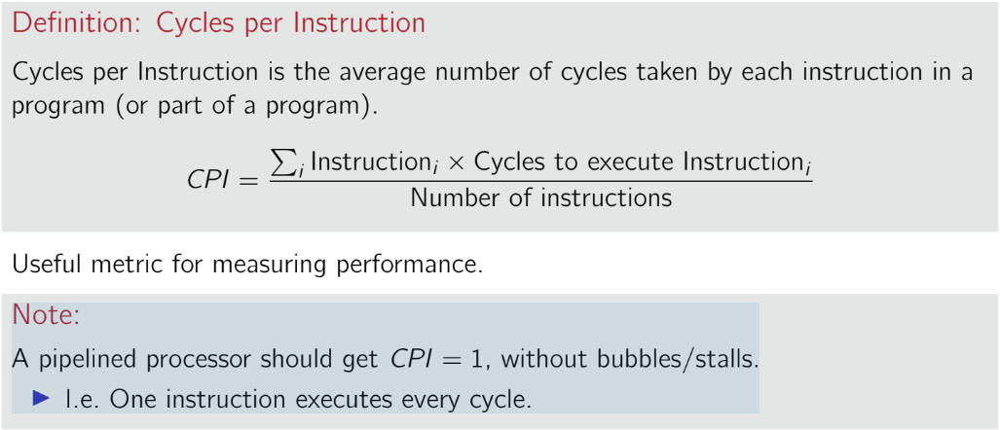
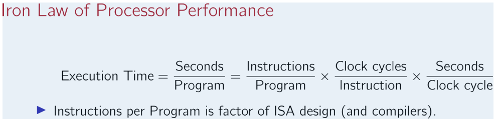
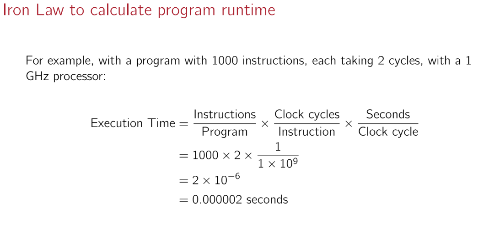
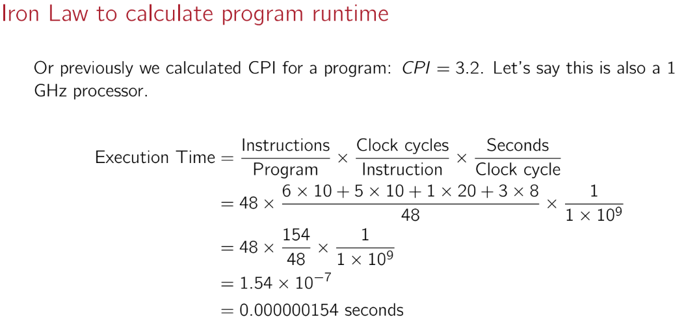
功率墙 (The Power Wall)：时钟频率受限于功耗。虽然可以通过降低电压（Dennard 缩放）来提升主频，但过低电压会导致漏电 。

冒险Hazards会导致流水线停顿，使得下一条指令无法在下一个周期执行。
结构冒险 (Structural Hazards)：两条指令同时竞争同一硬件资源。
控制冒险 (Control Hazards)：由分支指令引起。由于不确定下一条取指地址，可能导致取错指令并丢弃，产生气泡 。  （解决方法：使用分支预测器预测结果以维持流水线流动。）
数据冒险 (Data Hazards)：不同阶段的指令修改/读取相同数据。
1，RAW (写后读)：真相关。第二条指令在第一条指令写回前就尝试读取。
2，WAR (读后写)：反相关。第二条指令在第一条读取前就更新了数据。
3，WAW (写后写)：输出相关。多条指令更新同一数据，顺序决定最终结果。
------------------------------------------------------------------------------------
Memory Hierarchy
# 存储层次结构 (Memory Hierarchy) 学习笔记

> [cite_start]**课程信息**：COMS10015 - University of Bristol [cite: 2, 4]
> [cite_start]**讲师**：Dr Tom Deakin (2026) [cite: 1, 3]

---

## [cite_start]1. 存储器的基本需求 [cite: 8]
[cite_start]在冯·诺依曼架构中，程序和数据都存储在内存中 [cite: 9]。
* [cite_start]**低延迟**：处理器访问存储器以获取操作指令，必须保证速度够快，避免处理器空转等待 [cite: 10, 11]。
* [cite_start]**大容量**：需要足够的空间来存放程序和海量数据 [cite: 12, 18]。
* [cite_start]**低成本**：制造价格必须低廉 [cite: 12, 20]。
* [cite_start]**寄存器扩展**：由于处理器寄存器数量较少，需要更大的内存空间支持存储 [cite: 21]。

## [cite_start]2. 存储技术对比 [cite: 27]
[cite_start]我们可以使用不同的技术构建存储器，如 Flip-flops、SRAM、DRAM（及 3D 堆叠 DRAM）、Flash、硬盘和磁带 [cite: 28, 29, 30, 31, 32, 33, 34]。

### [cite_start]SRAM vs. DRAM 核心差异 [cite: 39]
| 特性 | SRAM (静态随机存取存储器) | DRAM (动态随机存取存储器) |
| :--- | :--- | :--- |
| **持久性** | [cite_start]易失性 [cite: 41] | [cite_start]易失性 [cite: 47] |
| **速度** | [cite_start]访问速度快（无电容） [cite: 42] | [cite_start]访问速度慢（有电容） [cite: 48] |
| **密度** | [cite_start]密度低（6 晶体管/单元） [cite: 43] | [cite_start]密度高（1 晶体管+1 电容/单元） [cite: 49] |
| **成本** | [cite_start]成本高 [cite: 43] | [cite_start]成本低 [cite: 50] |
| **刷新** | [cite_start]无需刷新 [cite: 44] | [cite_start]需要刷新 [cite: 51] |

## [cite_start]3. 存储层次的权衡 (Trade-offs) [cite: 84]
存储设计存在不可避免的权衡：
* [cite_start]**越大越慢**：寻找特定位置所需的时间随着容量增加而变长 [cite: 86]。
* [cite_start]**越快越贵**：由于技术限制，高速度意味着高成本 [cite: 86]。
* [cite_start]**高带宽昂贵**：需要更多的布线支撑 [cite: 87, 88]。

### [cite_start]性能参考 (以 2.2 GHz 处理器为例) [cite: 67]
* [cite_start]**SRAM**: 延迟约 1-50 个周期（10^3-10^6 字节） [cite: 63]。
* [cite_start]**DRAM**: 延迟约 200 个周期（约 100 纳秒） [cite: 64]。
* [cite_start]**硬盘**: 延迟达数十毫秒（TB 级别） [cite: 65]。

## [cite_start]4. 缓存机制 (Caches) [cite: 92]
[cite_start]由于主存（DRAM）访问延迟高达约 200 个周期，处理器需要缓存来加速数据请求 [cite: 93, 98]。

### [cite_start]多级缓存示例 (Skylake 架构) [cite: 114]
* [cite_start]**L1 Cache**: 4 周期延迟，32 KB（每核心私有） [cite: 114, 115]。
* [cite_start]**L2 Cache**: 12 周期延迟，1 MB（每核心私有） [cite: 114, 115]。
* [cite_start]**L3 Cache**: 约 44 周期延迟，1.375 MB（所有核心共享资源） [cite: 114]。

## [cite_start]5. 存储层次结构全景 [cite: 120]
1. [cite_start]**寄存器 (Registers)**: 基于触发器，小而极快 [cite: 120]。
2. [cite_start]**缓存 (Caches)**: 基于 SRAM，较小且快 [cite: 120]。
3. [cite_start]**主存 (Main Memory)**: 基于 DRAM，较大且慢 [cite: 120]。
4. [cite_start]**磁盘 (Disk/Flash/Tape)**: 容量巨大且极慢 [cite: 120]。

### [cite_start]实践：Trinity 超级计算机 [cite: 122]
* [cite_start]**DRAM**: 约 2.3 PB 运行内存 [cite: 125]。
* [cite_start]**Flash**: 3.7 PB 半临时存储 [cite: 126]。
* [cite_start]**硬盘**: 78 PB 文件系统 [cite: 126]。
* [cite_start]**磁带**: 超过 100 PB 长期存储 [cite: 127]。

---

## [cite_start]历史补充：Grace Hopper 与纳秒 [cite: 71]
[cite_start]计算机科学家 Grace Hopper 博士 (1906–1992) 曾演示 1 纳秒约为 **11.8 英寸**，这代表了光在电线中 1 纳秒传播的距离 [cite: 73, 74, 75][cite_start]。她还发明了早期的链接器并开发了指令式编程语言 [cite: 77, 78]。
------------------------------------------------------------------------------------